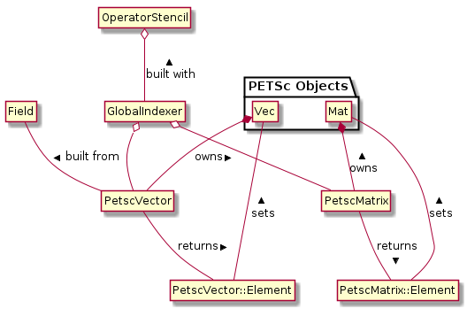
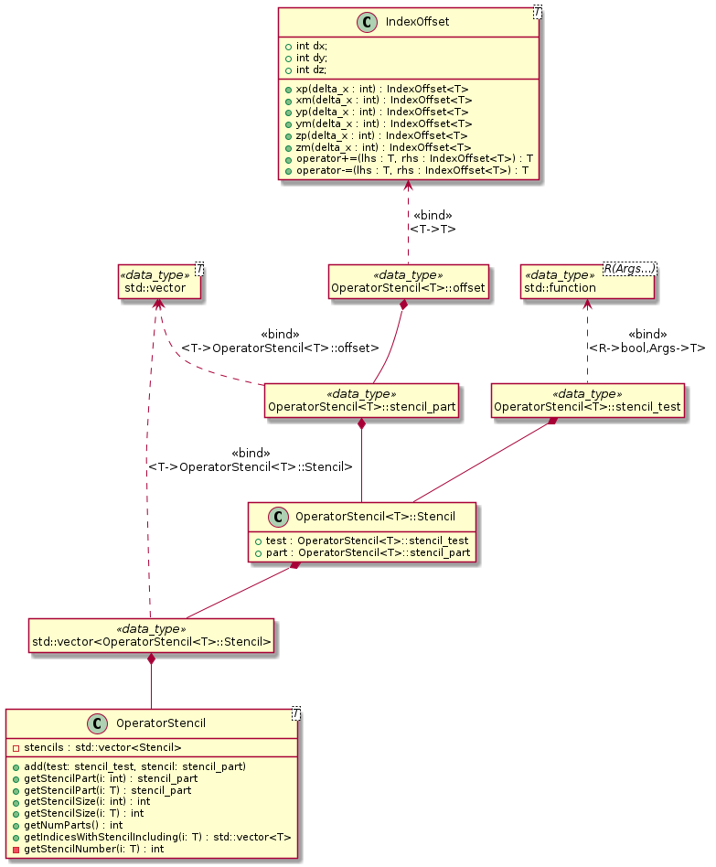
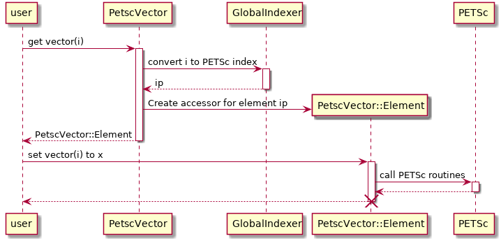

.. _sec-petsc-interface:

PETSc interface
===============

The `Portable, Extensible Toolkit for Scientific Computation (PETSc)
<https://www.mcs.anl.gov/petsc/>`_ provides a large collection of
numerical routines and solvers. It is used in BOUT++ for
:ref:`sec-time-integration` and :ref:`sec-laplacian`. However, it provides
quite a low-level C interface which is often difficult to use and
bears little resemblance to the data model of BOUT++. This is
particularly the case when making use of the ``Mat`` and ``Vec`` data-types
for linear solvers (such as the Laplacian inversions). Doing so
requires the developer to:

1. Flatten a `Field` into 1-D PETSc ``Vec`` objects.
   
   - Must decide which guard cells to include in ``Vec``
   - Must convert between  BOUT++ indices (local) and  indices used in
     PETSc ``Vec`` (global)
   
2. Use a PETSc ``Mat`` object to represent a finite-difference operator.
   
   - Again, must convert between local and global indices
   - Must determine sparsity pattern of matrix
   - If taking field-aligned derivatives, must perform interpolation
     
3. Call a Krylov solver with a preconditioner.
4. Convert the resulting ``Vec`` object back into a `Field`.

These tasks are error-prone and have historically been re-implemented
each time a PETSc solver is to be used. An interface to PETSc has now
been added which greatly simplifies its use. Furthermore, it has been
thoroughly unit-tested which should ensure improved reliability.

Overall Structure
-----------------

.. _fig-petsc-interface-overview:

   A UML diagram showing the design of the PETSc interface and the
   relationships between different components.

An `OperatorStencil` is used to describe the interdependencies
between cells in the grid, based on the finite difference operator
being inverted. This is used when constructing a `GlobalIndexer` to
work out which cells should be included in a ``Vec`` object. If
needed, it will also be used to work out the sparsity pattern of a
matrix. `PetscVector` and `PetscMatrix` objects are constructed from a
`GlobalIndexer` and wrap the PETSc ``Vec`` and ``Mat`` objects,
respectively. They provide routines for accessing individual elements
of the vector/matrix using ``PetscVector::Element`` and
``PetscMatrix::Element`` objects. All of these classes are
templates. `OperatorStencil` works for `SpecificInd` types (``Ind3D``,
``Ind2D``, ``IndPerp``), while the remaining classes work for the various
``Field`` types.

.. _sec-operator-stencil:

``OperatorStencil``
-------------------

This data type describes the strucutre of the finite difference
operator which is to be inverted. It uses a number of small
helper-types to do this (see :numref:`fig-operator-stencil`), the most
important of which is the ``IndexOffset``. This is a simple structure
which represents an offset from a ``SpecificInd<>`` type. It can be
added to or subtracted from ``SpecificInd<>`` objects, returning
an index which is suitably offset.

.. _fig-operator-stencil:

   UML diagram describing the structure of the OperatorStencil class.

Vectors of ``IndexOffset`` objects are coupled with tests which take a
``SpecificInd<>`` as an argument and return a boolean result
indicating whether the offsets describe the finite difference stencil
at that location. The ``OperatorStencil`` class contains a vector of
these pairs. When the stencil is requested for a given index, the
vector gets traversed in order, with offset returned from the first
passing test. Pairs of tests and offsets are placed in the
``OperatorStencil`` object using the ``add()`` method. It will
generally not be necessary for you to use any of the other methods on
this class unless you are doing further development work on the PETSc
interface.

Consider a 2-D Laplacian operator with the discretisation

:math:`\nabla^2 f(i,j) = \frac{f(i+1,j) - 2f(i,j) + f(i-1,j)}{\Delta
x^2} + \frac{f(i,j+1) - 2f(i,j) + f(i,j-1)}{\Delta y^2}`

and Neumann boundary conditions. Then an appropriate stencil could be
created using the following code.

::

     OperatorStencil<Ind2D> stencil;
     OffsetInd2D zero;

     // Add Laplace stencil for interior grid points
     stencil.add([xs = localmesh->xstart, xe = localmesh->xend, ys = localmesh->ystart,
                  ye = localmesh->yend](Ind2D ind) -> bool {
		    return ind.x() >= xs && ind.x() <= xe &&
		           ind.y() >= ys && ind.y() <= ye;},
		 {zero, zero.xp(), zero.xm(), zero.yp(), zero.zm()});

     // Add first-order differences for Neumann boundaries
     // Inner X
     stencil.add([xs = localmesh->xstart](Ind2D ind) -> bool {
                    return ind.x() < xs; }, {zero, zero.xp()});
     // Outer X
     stencil.add([xe = localmesh->xend](Ind2D ind) -> bool {
                    return ind.x() > xe; }, {zero, zero.xm()});
     // Lower Y
     stencil.add([ys = localmesh->ystart](Ind2D ind) -> bool {
                    return ind.y() < ys; }, {zero, zero.yp()});
     // Upper Y
     stencil.add([ye = localmesh->yend](Ind2D ind) -> bool {
                    return ind.y() > ye; }, {zero, zero.ym()});

``GlobalIndexer``
-----------------

Using an `OperatorStencil`, the `GlobalIndexer` constructor can now
determine which cells should be included in the PETSc ``Vec`` object
representing a `Field`. All interior cells are always
included. Guard cells which are required by the stencil to compute the
operation on internal cells are also included. A globally-unique index
is assigned to each cell which is meant to be included and the
communication routines on the `Mesh` type are used to determine the
indices in guard cells. There will be a unique `GlobalIndexer` object
for each `Mesh` and `OperatorStencil` pair. You will pass a
``std::shared_ptr<GlobalIndexer>`` object (with type-alias
``IndexerPtr``) when constructing ``PetscVector`` and ``PetscMatrix``
objects. As the process of creating a ``GlobalIndexer`` is quite
expensive and each one contains a field of indices, you will not want
to create any copies (hence the use of ``std::shared_ptr``).

In comparison to initialising an ``OperatorStencil`` object, creating
a `GlobalIndexer` is quite simple. The constructor takes 3 arguments,
two of which are optional:

- A pointer to the `Mesh` object for the indexer
- An `OperatorStencil`; if absent then the indexer will not include
  any guard cells in the PETSc objects and will not compute matrix
  sparsity patterns
- A boolean specifying whether communication of indices in guard cells
  will be performed in the constructor; defaults to ``true``,
  otherwise will need to call the ``initialise()`` method prior to use

An example of creating a ``GlobalIndexer`` with the
``OperatorStencil`` created in the previous example is given below.

::
   
    IndexerPtr<Field2D> indexer =
        std::make_shared<GlobalIndexer<Field2D>>(localmesh, stencil);

The ``GlobalIndexer`` class provides ``Region<>`` objects which can be
used for iterating over the cells which are included in PETSc ``Vec``
objects (see :ref:`sec-iterating`). This is useful for setting vector
and matrix elements. The relevant methods are:

- ``getRegionAll()`` returns a region containing all cells included in
  the PETSc objects
- ``getRegionNobndry()`` contains only the non-guard cells include in
  the PETSc objects (identical to ``RGN_NOBNDRY``)
- ``getRegionBndry()`` contains only guard cells which are also
  boundary cells
- ``getRegionLowerY()`` contains only guard cells in the lower
  Y-boundary
- ``getRegionUpperY()`` contains only guard cells in the upper
  Y-boundary
- ``getRegionInnerX()`` contains only guard cells in the inner
  X-boundary
- ``getRegionOuterX()`` contains only guard cells in the outer
  X-boundary

Note that not all guard-cells will be boundary cells; most will just
be used for communication between processors.

``PetscVector``
---------------

This class wraps PETSc ``Vec`` objects. The constructors/destructors
ensure memory will be allocated/freed as necessary. To create a new
vector, pass a `Field` and ``IndexerPtr`` to the constructor. This
will create a ``Vec`` object which is split between processors. The
``IndexerPtr`` will be used to convert between the local BOUT++
coordinate system and the global PETSc indices used to access elements
of the ``Vec`` object. The values in the ``Field`` will be copied into
the ``Vec``. The user can set individual elements using local BOUT++
indices and the parentheses operator ``()``. Once this is done, call
the ``assemble()`` method. This can be done using either assignment
(``=``) or in-place addition (``+=``). However, as in PETSc itself,
these operations can not be mixed, unless there is call to
``assemble()`` in between. A `PetscVector` can be converted back to a
`Field` object using the ``toField()`` method.

Below is an example of creating a vector which could be used as input
for a linear solver.

::

    Field2D rhs_vals; // Assume this is initialised with some data
    PetscVector<Field2D> rhs_vec(rhs_vals, indexer);

    // Set boundary values to 0
    BOUT_FOR(i, indexer.getRegionBndry()) {
      rhs_vec(i) = 0.;
    }
    rhs_vec.assemble();

If you plan to do any development of the PETSc interface (or simply
wish to understand how it works), see the UML sequence diagram in
:numref:`fig-petsc-vector`.

.. _fig-petsc-vector:

   A UML sequence diagram showing what happens when setting an element
   of a `PetscVector`. The `GlobalIndexer` is used to convert from the
   BOUT++ index to the one used by PETSc. A placeholder
   ``PetscVector::Element`` object is returned containing the index
   and a pointer to the ``Vec`` object. The assignment operator on
   this class makes a call to the PETSc routine ``VecSetValue``.

``PetscMatrix``
---------------

This class wraps a PETSc ``Mat`` object, including managing memory in
its constructors and destructor. This is a sparse matrix using the AIJ
storage method. It is split across multiple processors. The
`PetscMatrix` object is constructed from a ``IndexerPtr`` object;
unlike for a `PetscVector` it would not make sense to copy data from a
`Field` into a `PetscMatrix` object in the constructor. If the
`GlobalIndexer` has this data available, the sparsity pattern of the
``Mat`` object will be set. This allows memory to be pre-allocated for
it by PETSc, which dramatically improved performance.

As with `PetscVector` objectss, individual elements of a `PetscMatrix`
can be accessed using BOUT++ indices and the parentheses operator,
except that now two indices are required (corresponding to the row and
column of the matrix). These elements can be set using either
assignment or in-place addition. Once again, these two modes can not
be mixed unless the matrix is assembled in between, this time using
the ``partialAssemble()`` method. Before using the matrix a call must
be made to the ``assemble()`` method. This can be used between modes
of setting matrix elements as well, but is slower than
``partialAssemble()``.

It is possible to use one of these matrix objects to represent
finite-difference operations in the field-aligned direction. Much like
when working with `Fields` (see :ref:`sec-parallel-transforms`), this
can be achieved using the ``yup()`` and ``ydown()`` methods. These
return a shallow-copy of the matrix object, with a flag indicating it
is offset up or downwards in the y-direction. When using the
parentheses operator to get a particular matrix element, the mesh's
`ParallelTransform` object will be queried to find the positions and
weights needed to interpolate values along field lines. This
information is stored in the ``PetscMatrix::Element`` object which is
returned. When that object is assigned to, it will set multiple matrix
elements in the specified row, corresponding to each cell used to
interpolate the along-field value. Note that the same cell might be
used for interpolating more than one along-field value and it is thus
possible you would end up overwriting a matrix element that you
need. As such, you should always use in-place addition when using
``yup()`` and ``ydown()``.

Putting all of this together, a matrix can be created corresponding to
the Laplace operator defined in :ref:`sec-operator-stencil`.

::
   
    PetscMatrix<Field2D> matrix(indexer);
    Field2D &dx = localmesh->getCoordinates()->dx,
            &dy = localmesh->getCoordinates()->dy;

    // Set up x-derivatives
    BOUT_FOR(i, indexer->getRegionNobndry()) {
      matrix(i, i.xp()) = 1./SQ(dx[i]);
      matrix(i, i) = -2./SQ(dx[i]);
      matrix(i, i.xm()) = 1./SQ(dx[i]);
    }
    BOUT_FOR(i, indexer->getRegionInnerX()) {
      matrix(i, i.xp()) =  1./dx[i];
      matrix(i, i) = -1./dx[i];
    }
    BOUT_FOR(i, indexer->getRegionOuterX()) {
      matrix(i, i) =  1./dx[i];
      matrix(i, i.xm()) = -1./dx[i];
    }
    matrix.partialAssemble();

    // Set up y-derivatives
    BOUT_FOR(i, indexer->getRegionNobndry()) {
      matrix.yup()(i, i.yp()) += 1./SQ(dy[i]);
      matrix(i, i) += -2./SQ(dy[i]);
      matrix.ydown()(i, i.ym()) += 1/SQ(dy[i]);
    }
    BOUT_FOR(i, indexer->getRegionLowerY()) {
      matrix.yup()(i, i.yp()) += 1./dy[i];
      matrix(i, i) += -1./dy[i];
    }
    BOUT_FOR(i, indexer->getRegionUpperY()) {
      matrix(i, i) += 1./dy[i];
      matrix.ydown()(i, i.ym()) += -1./dy[i];
    }
    matrix.assemble();

Use With Other Parts of PETSc
-----------------------------

At present, only the ``Mat`` and ``Vec`` objects in PETSc have been
wrapped. This is because they are by far the most difficult components
to use and benefit the most from providing this interface. While in
future a C++ interface may be provided to other components of PETSc,
but for the time being it is not too difficult to use the raw C
API. This can be done by getting a pointer to the raw ``Mat`` and
``Vec`` objects using the ``PetscMatrix::get()`` and
``PetscVector::get()`` methods. For example, to set up and use a
linear solver for the problem in previous sections could be done as
below:

::
   
    MatSetBlockSize(*matrix.get(), 1);
    KSP solver;
    KSPSetOperators(solver, *matrix.get(), *matrix.get());
    KSPSetType(solver, "richardson")
    KSPRichardsonSetScale(solver, 1.0)
    KSPSetTolerances(solver, 1e-8, 1e-8, 1e6, 100000);
    KSPSetinitialGuessNonzero(solver, static_cast<PetscBool>(true));

    // Set up an algebraic multigrid preconditioner
    PC precond;
    KSPGetPC(solver, &precond);
    PCSetType(precond, PCGAMGAGG);
    PCGAMGSetSymGraph(precond, PETSC_TRUE);

    PetscVector<Field2D> guess = rhs_vec;
    guess.assemble();

    KSPSolve(solver, *rhs_vec.get(), *guess.get());
    KSPConvergedReason reason;
    KSPGetConvergedReason(solver, &reason);
    if (reason <= 0) {
      throw BoutException("PETSc solver failed to converge"):
    }

    Field2D solution = guess.toField();
