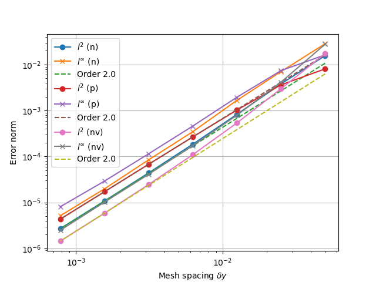

.. _sec-diffops:

Differential operators
======================

There are a huge number of possible ways to perform differencing in
computational fluid dynamics, and BOUT++ is intended to be able to
implement a large number of them. This means that the way differentials
are handled internally is quite involved; see the developer’s manual for
full gory details. Much of the time this detail is not all that
important, and certainly not while learning to use BOUT++. Default
options are therefore set which work most of the time, so you can start
using the code without getting bogged down in these details.

In order to handle many different differencing methods and operations,
many layers are used, each of which handles just part of the problem.
The main division is between differencing methods (such as 4th-order
central differencing), and differential operators (such as
:math:`\nabla_{||}`).

.. _sec-diffmethod:

Differencing methods
--------------------

Methods are typically implemented on *5-point* stencils (although
exceptions are possible) and are divided into three categories:

-  Central-differencing methods, for diffusion operators
   :math:`\frac{df}{dx}`, :math:`\frac{d^2f}{dx^2}`. Each method has a
   short code, and currently include

   -  ``C2``: 2\ :math:`^{nd}` order :math:`f_{-1} - 2f_0 + f_1`

   -  ``C4``: 4\ :math:`^{th}` order
      :math:`(-f_{-2} + 16f_{-1} - 30f_0 + 16f_1 - f_2)/12`

   -  ``S2``: 2\ :math:`^{nd}` order smoothing derivative
      
   -  ``W2``: 2\ :math:`^{nd}` order CWENO

   -  ``W3``: 3\ :math:`^{rd}` order CWENO

-  Upwinding methods for advection operators :math:`v_x\frac{df}{dx}`

   -  ``U1``: 1\ :math:`^{st}` order upwinding

   -  ``U2``: 2\ :math:`^{nd}` order upwinding
      
   -  ``U3``: 3\ :math:`^{rd}` order upwinding
      
   -  ``U4``: 4\ :math:`^{th}` order upwinding

   -  ``C2``: 2\ :math:`^{nd}` order central

   -  ``C4``: 4\ :math:`^{th}` order central

   -  ``W3``: 3\ :math:`^{rd}` order `Weighted Essentially
      Non-Oscillatory (WENO)`_

-  Flux conserving and limiting methods for terms of the form
   :math:`\frac{d}{dx}(v_x f)`

   -  ``U1``: 1\ :math:`^{st}` order upwinding

   -  ``C2``: 2\ :math:`^{nd}` order central

   -  ``C4``: 4\ :math:`^{th}` order central

Special methods :

- ``FFT``: Classed as a central method, Fourier Transform method in Z
   (axisymmetric) direction only. Currently available for ``first``
   and ``second`` order central difference

- ``SPLIT``: A flux method that splits into upwind and central terms
   :math:`\frac{d}{dx}(v_x f) = v_x\frac{df}{dx} + f\frac{dv_x}{dx}`
  

.. _Weighted Essentially Non-Oscillatory (WENO): https://doi.org/10.1137/S106482759732455X

WENO methods avoid overshoots (Gibbs phenomena) at sharp
gradients such as shocks, but the simple 1st-order method has very large
artificial diffusion. WENO schemes are a development of the ENO
reconstruction schemes which combine good handling of sharp-gradient
regions with high accuracy in smooth regions.

The stencil based methods are based by a kernel that combines the data
in a stencil to produce a single BoutReal (note upwind/flux methods
take extra information about the flow, either a ``BoutReal`` or
another ``stencil``). It is not anticipated that the user would wish
to apply one of these kernels directly so documentation is not
provided here for how to do so. If this is of interest please look at
``include/bout/index_derivs.hxx``. Internally, these kernel routines
are combined within a functor struct that uses a ``BOUT_FOR`` loop
over the domain to provide a routine that will apply the kernel to
every point, calculating the derivative everywhere. These routines are
registered in the appropriate ``DerivativeStore`` and identified by
the direction of differential, the staggering, the type
(central/upwind/flux) and a key such as "C2". The typical user does
not need to interact with this store, instead one can add the
following to the top of your physics module::

    #include <derivs.hxx>

to provide access to the following routines. These take care of
selecting the appropriate method from the store and ensuring the
input/output field locations are compatible.

.. _tab-coordinate-derivatives:
.. table:: Coordinate derivatives

   +--------------+-----------------------------------------------+
   | Function     | Formula                                       |
   +==============+===============================================+
   | DDX(f)       | :math:`\partial f / \partial x`               |
   +--------------+-----------------------------------------------+
   | DDY(f)       | :math:`\partial f / \partial y`               |
   +--------------+-----------------------------------------------+
   | DDZ(f)       | :math:`\partial f / \partial z`               |
   +--------------+-----------------------------------------------+
   | D2DX2(f)     | :math:`\partial^2 f / \partial x^2`           |
   +--------------+-----------------------------------------------+
   | D2DY2(f)     | :math:`\partial^2 f / \partial y^2`           |
   +--------------+-----------------------------------------------+
   | D2DZ2(f)     | :math:`\partial^2 f / \partial z^2`           |
   +--------------+-----------------------------------------------+
   | D4DX4(f)     | :math:`\partial^4 f / \partial x^4`           |
   +--------------+-----------------------------------------------+
   | D4DY4(f)     | :math:`\partial^4 f / \partial y^4`           |
   +--------------+-----------------------------------------------+
   | D4DZ4(f)     | :math:`\partial^4 f / \partial z^4`           |
   +--------------+-----------------------------------------------+
   | D2DXDZ(f)    | :math:`\partial^2 f / \partial x\partial z`   |
   +--------------+-----------------------------------------------+
   | D2DYDZ(f)    | :math:`\partial^2 f / \partial y\partial z`   |
   +--------------+-----------------------------------------------+
   | VDDX(f, g)   | :math:`f \partial g / \partial x`             |
   +--------------+-----------------------------------------------+
   | VDDY(f, g)   | :math:`f \partial g / \partial y`             |
   +--------------+-----------------------------------------------+
   | VDDZ(f, g)   | :math:`f \partial g / \partial z`             |
   +--------------+-----------------------------------------------+
   | FDDX(f, g)   | :math:`\partial/\partial x( f * g )`          |
   +--------------+-----------------------------------------------+
   | FDDY(f, g)   | :math:`\partial/\partial x( f * g )`          |
   +--------------+-----------------------------------------------+
   | FDDZ(f, g)   | :math:`\partial/\partial x( f * g )`          |
   +--------------+-----------------------------------------------+

By default the method used will be the one specified in the options
input file (see :ref:`sec-diffmethodoptions`), but most of these
methods can take an optional `std::string` argument (or a
`DIFF_METHOD` argument - to be deprecated), specifying exactly which
method to use.

.. _sec-diffmethod-userregistration:

User registered methods
-----------------------

.. note:: The following may be considered advanced usage.

It is possible for the user to define their own
differencing routines, either by supplying a stencil using kernel or
writing their own functor that calculates the differential
everywhere. It is then possible to register these methods with the
derivative store (for any direction, staggering etc.). For examples
please look at ``include/bout/index_derivs.hxx`` to see how these
approaches work.

Here is a verbose example showing how the ``C2`` method is
implemented.

::

   DEFINE_STANDARD_DERIV(DDX_C2, "C2", 1, DERIV::Stanard) {
       return 0.5*(f.p - f.m);
   };

   
Here `DEFINE_STANARD_DERIV` is a macro that acts on the kernel `return
0.5*(f.p - f.m);` and produces the functor that will apply the
differencing method over an entire field.  The macro takes several
arguments;

- the first (`DDX_C2`) is the name of the generated functor -- this
  needs to be unique and allows advanced users to refer to a specific
  derivative functor without having to go through the derivative store
  if desired.

- the second (`"C2"`) is the string key that is used to refer to this
  specific method when registering/retrieving the method from the
  derivative store.

- the third (`1`) is the number of guard cells required to be able to
  use this method (i.e. here the stencil will consist of three values
  -- the field at the current point and one point either side). This
  can be 1 or 2.

- the fourth (`DERIV::Standard`) identifies the type of method - here
  a central method.

Alongside `DEFINE_STANDARD_DERIV` there's also `DEFINE_UPWIND_DERIV`,
`DEFINE_FLUX_DERIV` and the staggered versions
`DEFINE_STANDARD_DERIV_STAGGERED`, `DEFINE_UPWIND_DERIV_STAGGERED` and
`DEFINE_FLUX_DERIV_STAGGERED`.

To register this method with the derivative store in `X` and `Z` with
no staggering for both field types we can then use the following code:

::

   produceCombinations<Set<WRAP_ENUM(DIRECTION, X), WRAP_ENUM(DIRECTION, Z)>,
                    Set<WRAP_ENUM(STAGGER, None)>,
                    Set<TypeContainer<Field2D, Field3D>>,
                    Set<DDX_C2>>
    someUniqueNameForDerivativeRegistration(registerMethod{});

For the common case where the user wishes to register the method in
`X`, `Y` and `Z` and for both field types we provide the helper
macros, `REGISTER_DERIVATIVE` and `REGISTER_STAGGERED_DERIVATIVE`
which could be used as `REGISTER_DERIVATIVE(DDX_C2)`.

To simplify matters further we provide `REGISTER_STANDARD_DERIVATIVE`,
`REGISTER_UPWIND_DERIVATIVE`, `REGISTER_FLUX_DERIVATIVE`,
`REGISTER_STANDARD_STAGGERED_DERIVATIVE`,
`REGISTER_UPWIND_STAGGERED_DERIVATIVE` and
`REGISTER_FLUX_STAGGERED_DERIVATIVE` macros that can define and
register a stencil using kernel in a single step. For example:

::

   REGISTER_STANDARD_DERIVATIVE(DDX_C2, "C2", 1, DERIV::Standard) { return 0.5*(f.p-f.m);};

Will define the `DDX_C2` functor and register it with the derivative
store using key `"C2"` for all three directions and both fields with
no staggering.

.. _sec-diffmethod-mixedsecond:

Mixed second-derivative operators
---------------------------------

Coordinate derivatives commute, as long as the coordinates are globally well-defined, i.e.

.. math::

    \frac{\partial}{\partial x} \left(\frac{\partial}{\partial y} f \right)
    = \frac{\partial}{\partial y} \left(\frac{\partial}{\partial x} f \right) \\
    \frac{\partial}{\partial y} \left(\frac{\partial}{\partial z} f \right)
    = \frac{\partial}{\partial z} \left(\frac{\partial}{\partial y} f \right) \\
    \frac{\partial}{\partial z} \left(\frac{\partial}{\partial x} f \right)
    = \frac{\partial}{\partial x} \left(\frac{\partial}{\partial z} f \right)

When using ``paralleltransform = shifted`` or ``paralleltransform = fci`` (see
:ref:`sec-parallel-transforms`) we do not have globally well-defined coordinates. In those
cases the coordinate systems are field-aligned, but the grid points are at constant
toroidal angle. The field-aligned coordinates are defined locally, on planes of constant
:math:`y`. There are different coordinate systems for each plane. However, within each
local coordinate system the derivatives do commute. :math:`y`-derivatives are taken in the
local field-aligned coordinate system, so mixed derivatives are calculated as

::

    D2DXDY(f) = DDX(DDY(f))
    D2DYDZ(f) = DDZ(DDY(f))

This order is simpler -- the alternative is possible. Using second-order central
difference operators for the y-derivatives we could calculate (not worring about
communications or boundary conditions here)

::

    Field3D D2DXDY(Field3D f) {
      auto result{emptyFrom(f)};
      auto& coords = \*f.getCoordinates()

      auto dfdx_yup = DDX(f.yup());
      auto dfdx_ydown = DDX(f.ydown());

      BOUT_FOR(i, f.getRegion()) {
        result[i] = (dfdx_yup[i.yp()] - dfdx_ydown[i.ym()]) / (2. * coords.dy[i])
      }

      return result;
    }

This would give equivalent results to the previous form [#]_ as ``yup`` and ``ydown`` give
the values of ``f`` one grid point along the magnetic field *in the local field-aligned
coordinate system*.

The :math:`x\mathrm{-}z` derivative is unaffected as it is taken entirely on a plane of
constant :math:`y` anyway. It is evaluated as

::

    D2DXDZ(f) = DDZ(DDX(f))

As the ``z``-direction is periodic and the ``z``-grid is not split across processors,
``DDZ`` does not require any guard cells. By taking ``DDZ`` second, we do not have to
communicate or set boundary conditions on the result of ``DDX`` or ``DDY`` before taking
``DDZ``.

The derivatives in ``D2DXDY(f)`` are applied in two steps. First ``dfdy = DDY(f)`` is
calculated; ``dfdy`` is communicated and has a boundary condition applied so that all the
x-guard cells are filled. The boundary condition is ``free_o3`` by default (3rd order
extrapolation into the boundary cells), but can be specified with the fifth argument to
``D2DXDY`` (see :ref:`sec-bndryopts` for possible options). Second ``DDX(dfdy)`` is
calculated, and returned from the function.

.. [#] Equivalent but not exactly the same numerically. Expanding out the derivatives in
       second-order central-difference form shows that the two differ in the grid points
       at which they evaluate ``dx`` and ``dy``. As long as the grid spacings are smooth
       this should not affect the order of accuracy of the scheme (?).

.. _sec-diffmethod-nonuniform:

Non-uniform meshes
------------------

**examples/test-nonuniform seems to not work?** Setting
``non_uniform = true`` in the BOUT.inp options file enables corrections
to second derivatives in :math:`X` and :math:`Y`. This correction is
given by writing derivatives as:

.. math::

   {{\frac{\partial f}{\partial x}}} \simeq \frac{1}{\Delta x} {{\frac{\partial f}{\partial i}}}

where :math:`i` is the cell index number. The second derivative is
therefore given by

.. math::

   \frac{\partial^2 f}{\partial x^2} \simeq \frac{1}{\Delta x^2}\frac{\partial^2
   f}{\partial i^2} + \frac{1}{\Delta x}{{\frac{\partial f}{\partial x}}} \cdot
   {{\frac{\partial }{\partial i}}}(\frac{1}{\Delta x})

The correction factor :math:`\partial/\partial i(1/\Delta x)` can
be calculated automatically, but you can also specify ``d2x`` in the
grid file which is

.. math::

   \texttt{d2x} = {{\frac{\partial \Delta x}{\partial i}}} = \frac{\partial^2 x}{\partial i^2}

The correction factor is then calculated from ``d2x`` using

.. math::

   {{\frac{\partial }{\partial i}}}(\frac{1}{\Delta x}) = -\frac{1}{\Delta x^2} {{\frac{\partial \Delta x}{\partial i}}}

**Note**: There is a separate switch in the :ref:`Laplacian inversion code <sec-laplacian>`,
which enables or disables non-uniform mesh corrections.

General operators
-----------------

These are differential operators which are for a general coordinate
system.

.. math::

   \begin{array}{rclrcl}
   \mathbf{v} =& \nabla f &\qquad {\texttt{Vector}} =& {\texttt{Grad(Field)}} \\
   f =& \nabla\cdot\mathbf{a} &\qquad {\texttt{Field}} =& {\texttt{Div(Vector)}} \\
   \mathbf{v} =& \nabla\times\mathbf{a} &\qquad {\texttt{Vector}} =&
   {\texttt{Curl(Vector)}} \\
   f =& \mathbf{v}\cdot\nabla g &\qquad {\texttt{Field}} =& {\texttt{V\_dot\_Grad(Vector,
   Field)}} \\
   \mathbf{v} =& \mathbf{a}\cdot\nabla\mathbf{c} &\qquad {\texttt{Vector}} =&
   {\texttt{V\_dot\_Grad(Vector, Vector)}} \\
   f =& \nabla^2 f &\qquad {\texttt{Field}} =& {\texttt{Laplace(Field)}}
   \end{array}

.. math::

   \nabla\phi =& {{\frac{\partial \phi}{\partial u^i}}}\nabla u^i \rightarrow (\nabla\phi)_i =
       {{\frac{\partial \phi}{\partial u^i}}} \\ \nabla\cdot A =& =
       \frac{1}{J}{{\frac{\partial }{\partial u^i}}}(Jg^{ij}A_j) \\ \nabla^2\phi =&
       G^j{{\frac{\partial \phi}{\partial u^i}}} + g^{ij}\frac{\partial^2\phi}{\partial u^i\partial
       u^j}

where we have defined

.. math::

   G^j = \frac{1}{J}{{\frac{\partial }{\partial u^i}}}(Jg^{ij})

**not** to be confused with the Christoffel symbol of the second kind
(see the coordinates manual for more details).

Clebsch operators
-----------------

Another set of operators assume that the equilibrium magnetic field is
written in Clebsch form as

.. math::

   \mathbf{B}_0 = \nabla z\times\nabla x \qquad B_0 = \frac{\sqrt{g_{yy}}}{J}

where

.. math::

   \mathbf{B}_0 = |\mathbf{B}_0|\mathbf{b}_0 = B_0 \mathbf{b}_0

is the background *equilibrium* magnetic field.

+------------------+----------------------------------------------------+
| Function         |                      Formula                       |
+------------------+----------------------------------------------------+
| ``Grad_par``     | |grad_par|                                         |
+------------------+----------------------------------------------------+
| ``Div_par``      | |div_par|                                          |
+------------------+----------------------------------------------------+
| ``Grad2_par2``   | |grad2_par2|                                       |
+------------------+----------------------------------------------------+
| ``Laplace_par``  | |laplace_par|                                      |
+------------------+----------------------------------------------------+
| ``Laplace_perp`` | |laplace_perp|                                     |
+------------------+----------------------------------------------------+
| ``Delp2``        | Perpendicular Laplacian, neglecting all :math:`y`  |
|                  | derivatives. The `Laplacian` solver performs the   |
|                  | inverse operation                                  |
+------------------+----------------------------------------------------+
| ``brackets``     | Poisson brackets. The Arakawa option, neglects the |
|                  | parallel :math:`y` derivatives if :math:`g_{xy}`   |
|                  | and :math:`g_{yz}` are non-zero                    |
+------------------+----------------------------------------------------+

.. |grad_par| replace:: :math:`\partial^0_{||} =
   \mathbf{b}_0\cdot\nabla =
   \frac{1}{\sqrt{g_{yy}}}{{\frac{\partial }{\partial y}}}`
.. |div_par| replace:: :math:`\nabla^0_{||}f =
   B_0\partial^0_{||}(\frac{f}{B_0})`
.. |grad2_par2| replace:: :math:`\partial^2_{||}\phi =
   \partial^0_{||}(\partial^0_{||}\phi) =
   \frac{1}{\sqrt{g_{yy}}}{{\frac{\partial}{\partial
   y}}}(\frac{1}{\sqrt{g_{yy}}}){{\frac{\partial \phi}{\partial y}}} +
   \frac{1}{g_{yy}}\frac{\partial^2\phi}{\partial y^2}`
.. |laplace_par| replace:: :math:`\nabla_{||}^2\phi =
   \nabla\cdot\mathbf{b}_0\mathbf{b}_0\cdot\nabla\phi =
   \frac{1}{J}{{\frac{\partial}{\partial
   y}}}(\frac{J}{g_{yy}}{{\frac{\partial \phi}{\partial y}}})`
.. |laplace_perp| replace:: :math:`\nabla_\perp^2 = \nabla^2 -
   \nabla_{||}^2`

We have that

.. math::

   \mathbf{b}_0\cdot\nabla\phi\times\nabla A =
       \frac{1}{J\sqrt{g_{yy}}}[(g_{yy}{{\frac{\partial \phi}{\partial z}}} -
       g_{yz}{{\frac{\partial \phi}{\partial y}}}){{\frac{\partial A}{\partial x}}}
       + (g_{yz}{{\frac{\partial \phi}{\partial x}}}
       - g_{xy}{{\frac{\partial \phi}{\partial z}}}){{\frac{\partial A}{\partial y}}}
       + (g_{xy}{{\frac{\partial \phi}{\partial y}}}
       - g_{yy}{{\frac{\partial \phi}{\partial x}}}){{\frac{\partial A}{\partial z}}}]

.. math::

   \nabla_\perp \equiv \nabla - {{\mathbf{b}}}({{\mathbf{b}}}\cdot\nabla)

.. math::

   {{\mathbf{b}}}\cdot\nabla = \frac{1}{JB}\frac{\partial}{\partial y}

.. math::

   {{\boldsymbol{b}}} = \frac{1}{JB}{{\boldsymbol{e}}}_y = \frac{1}{JB}[g_{xy}\nabla x + g_{yy}\nabla y
   + g_{yz}\nabla z]

In a Clebsch coordinate system
:math:`{{\boldsymbol{B}}} = \nabla z \times \nabla x = \frac{1}{J}{{\boldsymbol{e}}}_y`,
:math:`g_{yy} = {{\boldsymbol{e}}}_y\cdot{{\boldsymbol{e}}}_y = J^2B^2`,
and so the :math:`\nabla y` term cancels out:

.. math::

   \nabla_\perp = \nabla x({{\frac{\partial }{\partial x}}} -
       \frac{g_{xy}}{(JB)^2}{{\frac{\partial }{\partial y}}}) + \nabla z({{\frac{\partial }{\partial z}}} -
       \frac{g_{yz}}{(JB)^2}{{\frac{\partial }{\partial y}}})

The bracket operators
---------------------

The bracket operator ``brackets(phi, f, method)`` aims to
differentiate equations on the form

.. math::

   -\frac{\nabla\phi\times{{\boldsymbol{b}}}}{B}\cdot\nabla f

Notice that when we use the Arakawa scheme, :math:`y`-derivatives are
neglected if :math:`g_{xy}` and :math:`g_{yz}` are non-zero. An
example of usage of the brackets can be found in for example
``examples/MMS/advection`` or ``examples/blob2d``.

Finite volume, conservative finite difference methods
-----------------------------------------------------

These schemes aim to conserve the integral of the advected quantity
over the domain. If :math:`f` is being advected, then

.. math::

   \sum_i \left(f J dx dy dz\right)_i = const

is conserved, where the index :math:`i` refers to cell index. This
is done by calculating fluxes between cells: Whatever leaves one
cell is added to another. There are several caveats to this:

* Boundary fluxes can still lead to changes in the total, unless
  no-flow boundary conditions are used

* When using an implicit time integration scheme, such as the default
  PVODE / CVODE, the total is not guaranteed to be conserved, but
  may vary depending on the solver tolerances.

* There will always be a small rounding error, even with double
  precision.

The methods can be used by including the
:doc:`header<../_breathe_autogen/file/fv__ops_8cxx>`::

   #include "bout/fv_ops.hxx"

**Note** The methods are defined in a namespace ``FV``.

Some methods (those with templates) are defined in the header, but others
are defined in :doc:`src/mesh/fv_ops.cxx<../_breathe_autogen/file/fv__ops_8cxx>`.

Parallel divergence ``Div_par``
~~~~~~~~~~~~~~~~~~~~~~~~~~~~~~~

This function calculates the divergence of a flow in :math:`y` (parallel
to the magnetic field) by a given velocity.

::

   template<typename CellEdges = MC>
   const Field3D Div_par(const Field3D &f_in, const Field3D &v_in,
                         const Field3D &a, bool fixflux=true);

where ``f_in`` is the quantity being advected (e.g. density), ``v_in``
is the parallel advection velocity. The third input, ``a``, is the maximum
wave speed, which multiplies the dissipation term in the method.

::

   ddt(n) = -FV::Div_par( n, v, cs );

By default the ``MC`` slope limiter is used to calculate cell edges, but this can
be changed at compile time e.g::

   ddt(n) = -FV::Div_par<FV::Fromm>( n, v, cs );

A list of available limiters is given in section :ref:`sec-slope-limiters` below.

Example and convergence test
++++++++++++++++++++++++++++

The example code ``examples/finite-volume/fluid/`` solves the Euler
equations for a 1D adiabatic fluid, using `FV::Div_par` for
the advection terms.

.. math::

   \frac{\partial n}{\partial t} + \nabla_{||}\left(n v_{||}\right) = 0

   \frac{\partial p}{\partial t} + \nabla_{||}\left(p v_{||}\right) = -(\gamma-1) p \nabla_{||}v_{||}

   \frac{\partial}{\partial t}\left(nv_{||}\right) + \nabla_{||}\left(nv_{||}v_{||}\right) = -\partial_{||} p

where :math:`n` is the density, :math:`p` is the pressure, and
:math:`nv_{||}` is the momentum in the direction parallel to the
magnetic field.  The operator :math:`\nabla_{||}` represents the
divergence of a parallel flow (``Div_par``), and :math:`\partial_{||}
= \mathbf{b}\cdot\nabla` is the gradient in the parallel direction.

There is a convergence test using the Method of Manufactured Solutions (MMS) for this example.
See section :ref:`sec-mms` for details of the testing method. Running the ``runtest``
script should produce the graph

   Convergence test, showing :math:`l^2` (RMS) and :math:`l^{\infty}` (maximum) error for
   the evolving fields `n` (density), `p` (pressure) and `nv` (momentum). All fields are
   shown to converge at the expected second order accuracy.

Parallel diffusion
~~~~~~~~~~~~~~~~~~

The parallel diffusion operator calculates :math:`\nabla_{||}\left[k\partial_||\left(f\right)\right]`

::

   const Field3D Div_par_K_Grad_par(const Field3D &k, const Field3D &f,
                                    bool bndry_flux=true);

This is done by calculating the flux :math:`k\partial_{||}\left(f\right)` on cell boundaries
using central differencing.

Advection in 3D
~~~~~~~~~~~~~~~

This operator calculates :math:`\nabla\cdot\left( n \mathbf{v} \right)` where
:math:`\mathbf{v}` is a 3D vector. It is written in flux form by discretising the expression

.. math::

   \nabla\cdot\left( \mathbf{A} \right) = \frac{1}{J}\partial_i \left(J A^i\right)

Like the ``Div_par`` operator, a slope limiter is used to calculate the value of
the field :math:`n` on cell boundaries. By default this is the MC method, but
this can be set as a template parameter.

::

   template<typename CellEdges = MC>
   const Field3D Div_f_v(const Field3D &n, const Vector3D &v, bool bndry_flux)

.. _sec-slope-limiters:

Slope limiters
~~~~~~~~~~~~~~

Here limiters are implemented as slope limiters: The value of a given
quantity is calculated at the faces of a cell based on the cell-centre
values. Several slope limiters are defined in ``fv_ops.hxx``:

* ``Upwind`` - First order upwinding, in which the left and right edges
  of the cell are the same as the centre (zero slope).

* ``Fromm`` - A second-order scheme which is a fixed weighted average
  of upwinding and central difference schemes.

* ``MinMod`` - This second order scheme switches between the upwind and
  downwind gradient, choosing the one with the smallest absolute value.
  If the gradients have different signs, as at a maximum or minimum,
  then the method reverts to first order upwinding (zero slope).

* ``MC`` (Monotonised Central) is a second order scheme which switches
  between central, upwind and downwind differencing in a similar way
  to ``MinMod``. It has smaller dissipation than ``MinMod`` so is the
  default.

.. _sec-staggeredgrids:

Staggered grids
~~~~~~~~~~~~~~~

By default, all quantities in BOUT++ are defined at cell centre, and all
derivative methods map cell-centred quantities to cell centres.
Switching on staggered grid support in BOUT.inp::

    StaggerGrids = true

allows quantities to be defined on cell boundaries. Functions such as
``DDX`` now have to handle all possible combinations of input and output
locations, in addition to the possible derivative methods.

Several things are not currently implemented, which probably should be:

-  Only 3D fields currently have a cell location attribute. The location
   (cell centre etc) of 2D fields is ignored at the moment. The
   rationale for this is that 2D fields are assumed to be slowly-varying
   equilibrium quantities for which it won’t matter so much. Still,
   needs to be improved in future

-  Twist-shift and X shifting still treat all quantities as
   cell-centred.

-  No boundary condition functions yet account for cell location.

Currently, BOUT++ does not support values at cell corners; values can
only be defined at cell centre, or at the lower X,Y, or Z boundaries.
This is

Once staggered grids are enabled, two types of stencil are needed: those
which map between the same cell location (e.g. cell-centred values to
cell-centred values), and those which map to different locations (e.g.
cell-centred to lower X).

.. figure:: ../figs/diffStencils.*
   :alt: Stencils with cell-centred and lower shifted values

   Stencils with cell-centred (solid) and lower shifted values (open).
   Processor boundaries marked by vertical dashed line

Central differencing using 4-point stencil:

.. math::

   \begin{aligned}
   y &=& \left(9y_{-1/2} + 9y_{1/2} - y_{-3/2} - y_{3/2}\right) / 16 \\
   {{\frac{\partial y}{\partial x}}} &=& \left( 27y_{1/2} - 27y_{-1/2} - y_{3/2} + y_{-3/2}\right) / 24\Delta x \\
   \frac{\partial^2 y}{\partial x^2} &=& \left(y_{3/2} + y_{-3/2} - y_{1/2} - y_{-1/2}\right) / 2\Delta x^2\end{aligned}

+----------+-------------------+----------------------------------------------------------------+
| Input    | Output            | Actions                                                        |
+==========+===================+================================================================+
|          | Central stencil   |                                                                |
+----------+-------------------+----------------------------------------------------------------+
| CENTRE   | XLOW              | Lower staggered stencil                                        |
+----------+-------------------+----------------------------------------------------------------+
| XLOW     | CENTRE            | Upper staggered stencil                                        |
+----------+-------------------+----------------------------------------------------------------+
| XLOW     | Any               | Staggered stencil to CENTRE, then interpolate                  |
+----------+-------------------+----------------------------------------------------------------+
| CENTRE   | Any               | Central stencil, then interpolate                              |
+----------+-------------------+----------------------------------------------------------------+
| Any      | Any               | Interpolate to centre, use central stencil, then interpolate   |
+----------+-------------------+----------------------------------------------------------------+

Table: DDX actions depending on input and output locations. Uses first
match.

.. _sec-derivatives-of-fft:

Derivatives of the Fourier transform
------------------------------------

By using the definition of the Fourier transformed, we have

.. math::

   F(x,y,\xi) = {\int_{-\infty}^{\infty} {f(x,y,z)\exp(-2\pi iz\xi)} \; \text{d} {z}}

this gives

.. math::
   :label: f_derivative

   &{\int_{-\infty}^{\infty} {(\partial_zf[x,y,z])\exp(-2\pi iz\xi)} \; \text{d} {z}}\\
   =& {\int_{-\infty}^{\infty} {\partial_z(f[x,y,z]\exp[-2\pi iz\xi])} \; \text{d} {z}}
   - {\int_{-\infty}^{\infty} {f(x,y,z)\partial_z\exp(-2\pi iz\xi)} \; \text{d} {z}}\\
   =& (f[x,y,z]\exp[-2\pi iz\xi])\bigg|_{-\infty}^{\infty} - (-2\pi
   i\xi){\int_{-\infty}^{\infty} {f(x,y,z)\exp(-2\pi iz\xi)} \; \text{d} {z}}\\
   =& 2\pi i\xi F(x,y,\xi)

where we have used that :math:`f(x,y,\pm\infty)=0` in order to have a
well defined Fourier transform. This means that

.. math::

   \partial_z^n F(x,y,\xi) = (2\pi i \xi)^n F(x,y,\xi)

In our case, we are dealing with periodic boundary conditions. Strictly
speaking, the Fourier transform does not exist in such cases, but it is
possible to define a Fourier transform in the limit which in the end
lead to the Fourier series [#]_ By discretising the spatial domain, it
is no longer possible to represent the infinite amount of Fourier modes,
but only :math:`N+1` number of modes, where :math:`N` is the number of
points (this includes the modes with negative frequencies, and the
zeroth offset mode). For the discrete Fourier transform, we have

.. math::
   :label: DFT

   F(x,y)_{k} = \frac{1}{N}\sum_{Z=0}^{N-1}f(x,y)_{Z}\exp(\frac{-2\pi i k Z}{N})

where :math:`k` is the mode number, :math:`N` is the number of points
in :math:`z`. If we call the sampling points of :math:`z` for
:math:`z_Z`, where :math:`Z = 0, 1 \ldots N-1`, we have that
:math:`z_Z = Z \text{d}z`. As our domain goes from :math:`[0, 2\pi[`,
we have that (since we have one less line segment than point)
:math:`\text{d}z (N-1) = L_z = 2\pi - \text{d}z`, which gives
:math:`\text{d}z = \frac{2\pi}{N}`.  Inserting this is equation
(:eq:`DFT`) yields

.. math::

   F(x,y)_{k} = \frac{1}{N}\sum_{Z=0}^{N-1}f(x,y)_{Z}\exp( - i k
   Z\text{d}z) = \frac{1}{N}\sum_{Z=0}^{N-1}f(x,y)_{Z}\exp( - i k z_Z)

The discrete version of equation (:eq:`f_derivative`) thus gives

.. math::

   \partial_z^n F(x,y)_k = (i k)^n F(x,y)_k

.. [#] For more detail see Bracewell, R. N. - The Fourier Transform
       and Its Applications 3rd Edition chapter 10
