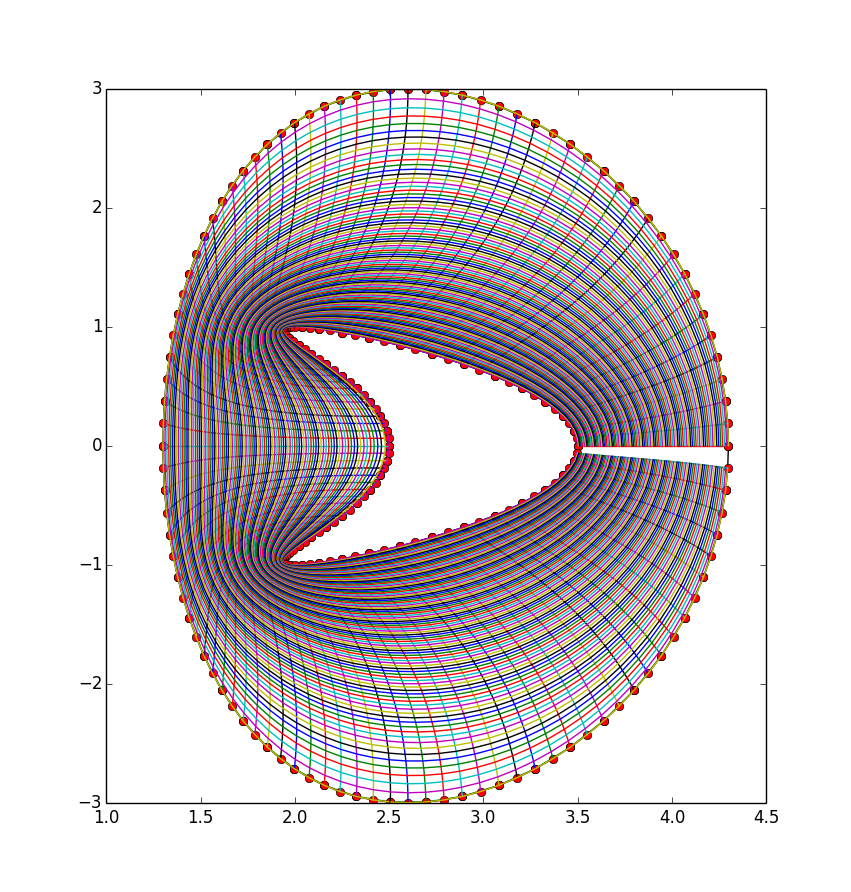
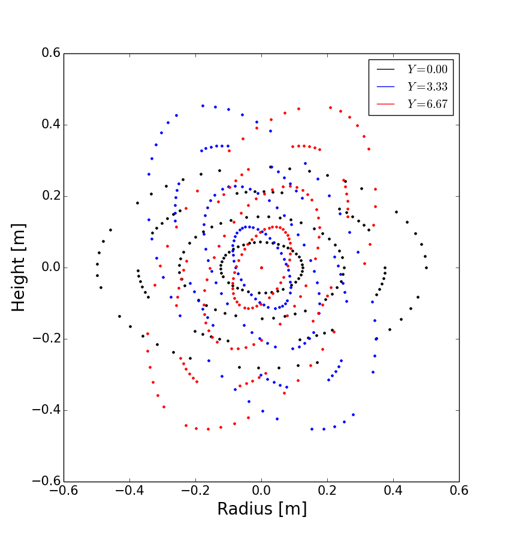

.. Use python as the default language for syntax highlighting in this file
.. highlight:: python

.. _sec-gridgen:

Generating input grids
======================

The simulation mesh describes the number and topology of grid points,
the spacing between them, and the coordinate system. For many problems,
a simple mesh can be created using options.

.. code-block:: cfg

    [mesh]
    nx = 260  # X grid size
    ny = 256  # Y grid size

    dx = 0.1  # X mesh spacing
    dy = 0.1  # Y mesh spacing

The above options will create a :math:`256\times 256` mesh in X and Y,
assuming there are 2 guard cells in X direction. The Z resolution can
be specified with MZ. The mesh spacing is :math:`0.1` in both
directions. By default the coordinate system is Cartesian (metric
tensor is the identity matrix), but this can be changed by specifying
the metric tensor components.

Integer quantities such as ``nx`` can be numbers (like “260”), or
expressions (like “256 + 2\*MXG”). 
A common use is to make ``x`` and ``z`` dimensions have the same
number of points, when ``x`` has ``mxg`` boundary cells on each
boundary but ``z`` does not (since it is usually periodic):

.. code-block:: cfg

    [mesh]
    nx = nz + 2*mxg  # X grid size
    nz = 256         # Z grid size            
    mxg = 2            

Note that the order of the defintion within a section isn't important,
variables can be used before they are defined. All variables are first
read, and only processed if they are used.
    
Expressions are always calculated in floating point; When expressions
are used to set integer quantities (such as the number of grid
points), the expressions are calculated in floating point and then
converted to an integer. The conversion is done by rounding to the
nearest integer, but throws an error if the floating point value is
not within 1e-3 of an integer. This is to minimise unexpected
behaviour. If you want to round any result to the nearest integer, use
the ``round`` function:

.. code-block:: cfg

    [mesh]
    nx = 256.4   # Error!
    nx = round(256.4) # ok

    
Real (floating-point) values can also be expressions, allowing quite
complicated analytic inputs. For example in the example ``test-griddata``:

.. code-block:: cfg

    # Screw pinch

    rwidth = 0.4

    Rxy = 0.1 + rwidth*x  # Radius from axis     [m]
    L   = 10              # Length of the device [m]

    dy = L/ny
    hthe = 1.0

    Zxy = L * y / (2*pi)

    Bpxy = 1.0      # Axial field [T]
    Btxy = 0.1*Rxy  # Azimuthal field [T]
    Bxy = sqrt(Btxy^2 + Bpxy^2)

    dr = rwidth / nx
    dx = dr * Bpxy * Rxy

These expressions use the same mechanism as used for variable
initialisation (:ref:`sec-expressions`): ``x`` is a variable from
:math:`0` to :math:`1` in the domain which is uniform in index space;
``y`` and ``z`` go from :math:`0` to :math:`2\pi`. As with variable
initialisation, common trigonometric and mathematical functions can be
used. In the above example, some variables depend on each other, for
example ``dy`` depends on ``L`` and ``ny``. The order in which these
variables are defined doesn’t matter, so ``L`` could be defined below
``dy``, but circular dependencies are not allowed (by default; see
section :ref:`sec-recursive-functions`). If the variables are defined
in the same section (as ``dy`` and ``L``) or a parent section, then no
section prefix is required. To refer to a variable in a different
section, prefix the variable with the section name, for example,
``section:variable`` or ``mesh:dx``.

More complex meshes can be created by supplying an input grid file to
describe the grid points, geometry, and starting profiles. Currently
BOUT++ supports NetCDF and HDF5 format binary files. During startup,
BOUT++ looks in the grid file for the following variables. If any are
not found, a warning will be printed and the default values used.

-  X and Y grid sizes (integers) ``nx`` and ``ny`` **REQUIRED**

-  Differencing quantities in 2D/3D arrays ``dx(nx,ny[,nz])``,
   ``dy(nx,ny[,nz])`` and ``dz(nx,ny[,nz])``. If these are not found
   they will be set to 1. To allow variation in ``z`` direction, BOUT++
   has to be configured ``--enable-metric-3d``, otherwise 2D fields are
   used for the metric fields. Note that prior to BOUT++ version 5
   ``dz`` was a constant.

-  Diagonal terms of the metric tensor :math:`g^{ij}` ``g11(nx,ny[,nz])``,
   ``g22(nx,ny[,nz])``, and ``g33(nx,ny[,nz])``. If not found, these will be set
   to 1.

-  Off-diagonal metric tensor :math:`g^{ij}` elements ``g12(nx,ny[,nz])``,
   ``g13(nx,ny[,nz])``, and ``g23(nx,ny[,nz])``. If not found, these will be set
   to 0.

-  Z shift for interpolation between field-aligned coordinates and
   non-aligned coordinates (see :ref:`sec-field-aligned-coordinates`). Parallel
   differential operators are calculated using a shift to field-aligned
   values when ``paralleltransform:type = shifted`` (or ``shiftedinterp``).
   The shifts must be provided in the gridfile in a field ``zshift(nx,ny)``.
   If not found, ``zshift`` is set to zero.

The remaining quantities determine the topology of the grid. These are
based on tokamak single/double-null configurations, but can be adapted
to many other situations.

-  Separatrix locations ``ixseps1``, and ``ixseps2`` If neither is
   given, both are set to nx (i.e. all points in closed “core” region).
   If only ``ixseps1`` is found, ``ixseps2`` is set to nx, and if only
   ixseps2 is found, ixseps1 is set to -1.

-  Branch-cut locations ``jyseps1_1``, ``jyseps1_2``, ``jyseps2_1``, and
   ``jyseps2_2``

-  Twist-shift matching condition ``ShiftAngle[nx]`` for field aligned
   coordinates. This is applied in the “core” region between indices
   ``jyseps2_2``, and ``jyseps1_1 + 1``, if either ``TwistShift = True``
   enabled in the options file or in general the ``TwistShift`` flag in
   ``mesh/impls/bout/boutmesh.hxx`` is enabled by other means. BOUT++
   automatically reads the twist shifts in the gridfile if the shifts
   are stored in a field ShiftAngle[nx]; ShiftAngle must be given in the
   gridfile or grid-options if ``TwistShift = True``.

The only quantities which are required are the sizes of the grid. If
these are the only quantities specified, then the coordinates revert to
Cartesian.

This section describes how to generate inputs for tokamak equilibria. If
you’re not interested in tokamaks then you can skip to the next section.

The directory ``tokamak_grids`` contains code to generate input grid
files for tokamaks. These can be used by, for example, the ``2fluid`` and
``highbeta_reduced`` modules.

.. _sec-bout-topology:

BOUT++ Topology
---------------

Basic
~~~~~

In order to handle tokamak geometry BOUT++ contains an internal topology
which is determined by the branch-cut locations (``jyseps1_1``,
``jyseps1_2``, ``jyseps2_1``, and ``jyseps2_2``) and separatrix
locations (``ixseps1`` and ``ixseps2``).

The separatrix locations, ``ixseps1`` and ``ixseps2``, give the indices
in the ``x`` domain where the first and second separatrices are located.

If ``ixseps1 == ixseps2`` then there is a single separatrix representing
the boundary between the core region and the SOL region and the grid is
a connected double null configuration. If ``ixseps1 > ixseps2`` then
there are two separatrices and the inner separatrix is ``ixseps2`` so
the tokamak is an upper double null. If ``ixseps1 < ixseps2`` then there
are two separatrices and the inner separatrix is ``ixseps1`` so the
tokamak is a lower double null.

In other words: Let us for illustrative purposes say that
``ixseps1 > ixseps2`` (see :numref:`fig-topology-cross-section`). Let
us say that we have a field ``f(x,y,z)`` with a global ``x``-index which
includes ghost points. ``f(x<=xseps1,y,z)``) will then be periodic in
the ``y``-direction, ``f(xspes1<x<=xseps2,y,z)``) will have boundary
condition in the ``y``-direction set by the lowermost ``ydown`` and
``yup``. If ``f(xspes2<x,y,z)``) the boundary condition in the
``y``-direction will be set by the uppermost ``ydown`` and ``yup``. As
for now, there is no difference between the two sets of upper and lower
``ydown`` and ``yup`` boundary conditions (unless manually specified,
see :ref:`sec-custom-BC`).

These values are set either in the grid file or in ``BOUT.inp``.
:numref:`fig-topology-cross-section` shows schematically how ``ixseps`` is
used.

The branch cut locations, ``jyseps1_1``, ``jyseps1_2``, ``jyseps2_1``,
and ``jyseps2_2``, split the ``y`` domain into logical regions defining
the SOL, the PFR (private flux region) and the core of the tokamak. This
is illustrated also in :numref:`fig-topology-cross-section`. If
``jyseps1_2 == jyseps2_1`` then the grid is a single null configuration,
otherwise the grid is a double null configuration.

.. _fig-topology-cross-section:
.. figure:: ../figs/topology_cross_section.*
   :alt: Cross-section of the tokamak topology used in BOUT++

   Deconstruction of a poloidal tokamak cross-section into logical
   domains using the parameters ``ixseps1``, ``ixseps2``,
   ``jyseps1_1``, ``jyseps1_2``, ``jyseps2_1``, and ``jyseps2_2``

Advanced
~~~~~~~~

The internal domain in BOUT++ is deconstructed into a series of
logically rectangular sub-domains with boundaries determined by the
``ixseps`` and ``jyseps`` parameters. The boundaries coincide with
processor boundaries so the number of grid points within each sub-domain
must be an integer multiple of ``ny/nypes`` where ``ny`` is the number
of grid points in ``y`` and ``nypes`` is the number of processors used
to split the y domain. Processor communication across the domain
boundaries is then handled internally. :numref:`fig-topology-schematic`
shows schematically how the different regions of a double null tokamak
with ``ixseps1 = ixseps2`` are connected together via communications.

.. note::
   To ensure that each subdomain follows logically, the
   ``jyseps`` indices must adhere to the following conditions:

    - ``jyseps1_1 > -1``
    - ``jyseps2_1 >= jyseps1_1 + 1``
    - ``jyseps1_2 >= jyseps2_1``
    - ``jyseps2_2 >= jyseps1_2``
    - ``jyseps2_2 <= ny - 1``

   To ensure that communications work branch cuts must align with
   processor boundaries.

.. _fig-topology-schematic:
.. figure:: ../figs/topology_schematic.*

   Schematic illustration of domain decomposition and communication in
   BOUT++ with ``ixseps1 = ixseps2``

Implementations
~~~~~~~~~~~~~~~

In BOUT++ each processor has a logically rectangular domain, so any
branch cuts needed for X-point geometry (see
:numref:`fig-topology-schematic`) must be at processor boundaries.

In the standard “bout” mesh (``src/mesh/impls/bout/``), the
communication is controlled by the variables

.. code-block:: cpp

    int UDATA_INDEST, UDATA_OUTDEST, UDATA_XSPLIT;
    int DDATA_INDEST, DDATA_OUTDEST, DDATA_XSPLIT;
    int IDATA_DEST, ODATA_DEST;

These control the behavior of the communications as shown in
:numref:`fig-boutmesh-comms`.

.. _fig-boutmesh-comms:
.. figure:: ../figs/boutmesh-comms.*
   :alt: Communication of guard cells in BOUT++

   Communication of guard cells in BOUT++. Boundaries in X have only
   one neighbour each, but boundaries in Y can be split into two,
   allowing branch cuts

In the Y direction, each boundary region (**U**\ p and **D**\ own in Y)
can be split into two, with ``0 <= x < UDATA_XSPLIT`` going to the
processor index ``UDATA_INDEST``, and ``UDATA_INDEST <= x < LocalNx`` going
to ``UDATA_OUTDEST``. Similarly for the Down boundary. Since there are
no branch-cuts in the X direction, there is just one destination for the
**I**\ nner and **O**\ uter boundaries. In all cases a negative
processor number means that there’s a domain boundary so no
communication is needed.

The communication control variables are set in the ``topology()``
function, in ``src/mesh/impls/bout/boutmesh.cxx`` starting around line
2056. First the function ``default_connections()`` sets the topology to
be a rectangle

To change the topology, the function ``set_connection`` checks that the
requested branch cut is on a processor boundary, and changes the
communications consistently so that communications are two-way and there
are no “dangling” communications.

3D variables
------------

BOUT++ was originally designed for tokamak simulations where the input
equilibrium varies only in X-Y, and Z is used as the axisymmetric
toroidal angle direction. In those cases, it is often convenient to have
input grids which are only 2D, and allow the Z dimension to be specified
independently, such as in the options file. The problem then is how to
store 3D variables in the grid file?

Two representations are now supported for 3D variables:

#. A Fourier representation. If the size of the toroidal domain is not
   specified in the grid file (``nz`` is not defined), then 3D fields
   are stored as Fourier components. In the Z dimension the coefficients
   must be stored as

   .. math::

      [n = 0, n = 1 (\textrm{real}), n = 1 (\textrm{imag}), n = 2
      (\textrm{real}), n = 2 (\textrm{imag}), \ldots ]

   where :math:`n` is the toroidal mode number. The size of the array
   must therefore be odd in the Z dimension, to contain a constant
   (:math:`n=0`) component followed by real/imaginary pairs for the
   non-axisymmetric components.

   If you are using IDL to create a grid file, there is a routine in
   ``tools/idllib/bout3dvar.pro`` for converting between BOUT++’s real
   and Fourier representation.

#. Real space, as values on grid points. If ``nz`` is set in the grid
   file, then 3D variables in the grid file must have size ``nx``\
   :math:`\times`\ ``ny``\ :math:`\times`\ ``nz``. These are then read
   in directly into `Field3D` variables as required.

From EFIT files
---------------

A separate tool (in python) called `Hypnotoad <https://github.com/boutproject/hypnotoad>`_
has been developed to create BOUT++ input files from R-Z equilibria. This can read EFIT ’g’
(geqdsk) files, find flux surfaces, and calculate metric
coefficients. 

From ELITE and GATO files
-------------------------

Currently conversions exist for ELITE ``.eqin`` and GATO ``dskgato``
equilibrium files. Conversion of these into BOUT++ input grids is in two
stages: In the first, both these input files are converted into a common
NetCDF format which describes the Grad-Shafranov equilibrium. These
intermediate files are then converted to BOUT++ grids using an
interactive IDL script.

Generating equilibria
---------------------

The directory ``tokamak_grids/shifted_circle`` contains IDL code to
generate shifted circle (large aspect ratio) Grad-Shafranov equilibria.

.. figure:: ../figs/grid_gen.*
    :alt: IDL routines and file formats used in taking output from
          different codes and converting into input to BOUT++.

    IDL routines and file formats used in taking output from different
    codes and converting into input to BOUT++.

.. _sec-zoidberg:

Zoidberg grid generator
-----------------------

The `Zoidberg <https://github.com/boutproject/zoidberg>`_ grid
generator creates inputs for the Flux Coordinate Independent (FCI)
parallel transform (section :ref:`sec-parallel-transforms`). The
domain is divided into a set of 2D grids in the X-Z coordinates, and
the magnetic field is followed along the Y coordinate from each 2D
grid to where it either intersects the forward and backward grid, or
hits a boundary.

The simplest code which creates an output file is::

   import zoidberg

   # Define the magnetic field
   field = zoidberg.field.Slab()
   # Define the grid points
   grid = zoidberg.grid.rectangular_grid(10,10,10)
   # Follow magnetic fields from each point
   maps = zoidberg.make_maps(grid, field)
   # Write everything to file
   zoidberg.write_maps(grid, field, maps, gridfile="grid.fci.nc")

As in the above code, creating an output file consists of the following steps:

1. Define a magnetic field
2. Define the grid points. This can be broken down into:
   
   a) Define 2D "poloidal" grids
   b) Form a 3D grid by putting 2D grids together along the Y direction

3. Create maps from each 2D grid to its neighbours
4. Save grids, fields and maps to file

Each of these stages can be customised to handle more complicated
magnetic fields, more complicated grids, and particular output
formats.  Details of the functionality available are described in
sections below, and there are several examples in the
``examples/zoidberg`` directory.

Rectangular grids
~~~~~~~~~~~~~~~~~

An important input to Zoidberg is the size of the domain in Y, and
whether the domain is periodic in Y. By default ``rectangular_grid`` makes
a non-periodic rectangular box which is of length 10 in the Y direction.
This means that there are boundaries at :math:`y=0` and at :math:`y=10`.
``rectangular_grid`` puts the y slices at equally spaced intervals, and puts
the first and last points half an interval away from boundaries in y.
In this case with 10 points in y (second argument to ``rectangular_grid(nx,ny,nz)``)
the y locations are :math:`\left(0.5, 1.5, 2.5, \ldots, 9.5\right)`.

At each of these y locations ``rectangular_grid`` defines a rectangular 2D poloidal grid in
the X-Z coordinates, by default with a length of 1 in each direction and centred on :math:`x=0,z=0`. 
These 2D poloidal grids are then put together into a 3D ``Grid``. This process can be customised
by separating step 2 (the ``rectangular_grid`` call) into stages 2a) and 2b). 
For example, to create a periodic rectangular grid we could use the following::

   import numpy as np

   # Create a 10x10 grid in X-Z with sides of length 1
   poloidal_grid = zoidberg.poloidal_grid.RectangularPoloidalGrid(10, 10, 1.0, 1.0)
   # Define the length of the domain in y
   ylength = 10.0
   # Define the y locations
   ycoords = np.linspace(0.0, ylength, 10, endpoint=False)
   # Create the 3D grid by putting together 2D poloidal grids
   grid = zoidberg.grid.Grid(poloidal_grid, ycoords, ylength, yperiodic=True)

In the above code the length of the domain in the y direction needs to be given to ``Grid``
so that it knows where to put boundaries (if not periodic), or where to wrap the domain
(if periodic). The array of y locations ycoords can be arbitrary, but note that finite
difference methods (like FCI) work best if grid point spacing varies smoothly.

A more realistic example is creating a grid for a MAST tokamak equilibrium from a G-Eqdsk
input file (this is in ``examples/zoidberg/tokamak.py``)::

   import numpy as np
   import zoidberg
   
   field = zoidberg.field.GEQDSK("g014220.00200") # Read magnetic field

   grid = zoidberg.grid.rectangular_grid(100, 10, 100,
          1.5-0.1, # Range in R (max - min)
          2*np.pi, # Toroidal angle
          3., # Range in Z
          xcentre=(1.5+0.1)/2, # Middle of grid in R
          yperiodic=True) # Periodic in toroidal angle

   # Create the forward and backward maps
   maps = zoidberg.make_maps(grid, field)
   
   # Save to file
   zoidberg.write_maps(grid, field, maps, gridfile="grid.fci.nc")

   # Plot grid points and the points they map to in the forward direction
   zoidberg.plot.plot_forward_map(grid, maps)
   
In the last example only one poloidal grid was created (a ``RectangularPoloidalGrid``)
and then re-used for each y slice. We can instead define a different grid for each y
position. For example, to define a grid which expands along y (for some reason) we could do::

   ylength = 10.0
   ycoords = np.linspace(0.0, ylength, 10, endpoint=False)
   # Create a list of poloidal grids, one for each y location
   poloidal_grids = [ RectangularPoloidalGrid(10, 10, 1.0 + y/10., 1.0 + y/10.)
                      for y in ycoords ]
   # Create the 3D grid by putting together 2D poloidal grids
   grid = zoidberg.grid.Grid(poloidal_grids, ycoords, ylength, yperiodic=True)

Note: Currently there is an assumption that the number of X and Z points is the
same on every poloidal grid. The shape of the grid can however be completely
different. The construction of a 3D ``Grid`` is the same in all cases, so for now
we will concentrate on producing different poloidal grids.

More general grids
~~~~~~~~~~~~~~~~~~

The FCI technique is not restricted to rectangular grids, and in particular
Zoidberg can handle structured grids in an annulus with quite complicated shapes.
The `StructuredPoloidalGrid` class handles quite general geometries,
but still assumes that the grid is structured and logically rectangular.
Currently it also assumes that the z index is periodic.

One way to create this grid is to define the grid points manually e.g.::

   import numpy as np
   import zoidberg

   # First argument is minor radius, second is angle
   r,theta = np.meshgrid(np.linspace(1,2,10),
                         np.linspace(0,2*np.pi, 10),
                         indexing="ij")
   
   R = r * np.sin(theta)
   Z = r * np.cos(theta)
  
   poloidal_grid = zoidberg.poloidal_grid.StructuredPoloidalGrid(R,Z)

For more complicated shapes than circles, Zoidberg comes with an
elliptic grid generator which needs to be given only the inner and
outer boundaries::

   import zoidberg

   inner = zoidberg.rzline.shaped_line(R0=3.0, a=0.5,
                            elong=1.0, triang=0.0, indent=1.0,
                            n=50)
   
   outer = zoidberg.rzline.shaped_line(R0=2.8, a=1.5,
                            elong=1.0, triang=0.0, indent=0.2,
                            n=50)
   
   poloidal_grid = zoidberg.poloidal_grid.grid_elliptic(inner, outer,
                                                 100, 100, show=True)

which should produce the figure below:

   
   A grid produced by ``grid_elliptic`` from shaped inner and outer lines

Grids aligned to flux surfaces
~~~~~~~~~~~~~~~~~~~~~~~~~~~~~~

The elliptic grid generator can be used to generate grids
whose inner and/or outer boundaries align with magnetic flux surfaces.
All it needs is two ``RZline`` objects as generated by ``zoidberg.rzline.shaped_line``,
one for the inner boundary and one for the outer boundary.
``RZline`` objects represent periodic lines in R-Z  (X-Z coordinates), with
interpolation using splines.

To create an ``RZline`` object for a flux surface we first need to find
where the flux surface is. To do this we can use a Poincare plot: Start at a point
and follow the magnetic field a number of times around the periodic y direction
(e.g. toroidal angle). Every time the field line reaches a y location of interest,
mark the position to build up a scattered set of points which all lie on the same
flux surface.

At the moment this will not work correctly for slab geometries, but expects
closed flux surfaces such as in a stellarator or tokamak. A simple test case
is a straight stellarator::
   
   import zoidberg
   field = zoidberg.field.StraightStellarator(I_coil=0.4, yperiod=10)

By default ``StraightStellarator`` calculates the magnetic field due to four coils which spiral around
the axis at a distance :math:`r=0.8` in a classical stellarator configuration. The ``yperiod``
argument is the period in y after which the coils return to their starting locations.
   
To visualise the Poincare plot for this stellarator field, pass the ``MagneticField`` object
to ``zoidberg.plot.plot_poincare``, together with start location(s) and periodicity information::

   zoidberg.plot.plot_poincare(field, 0.4, 0.0, 10.0)

which should produce the following figure:

   
   Poincare map of straight stellarator showing a single flux
   surface. Each colour corresponds to a different x-z plane
   in the y direction. 
           
The inputs here are the starting location :math:`\left(x,z\right) = \left(0.4, 0.0\right)`,
and the periodicity in the y direction (10.0). By default this will
integrate from this given starting location 40 times (``revs`` option) around the y domain (0 to 10). 

To create an ``RZline`` from these Poincare plots we need a
list of points in order around the line. Since the points
on a flux surface in a Poincare will not generally be in order
we need to find the best fit i.e. the shortest path which passes through all the points without crossing itself. In general
this is a `known hard problem <https://en.wikipedia.org/wiki/Travelling_salesman_problem>`_
but fortunately in this case the nearest neighbour algorithm seems to be quite robust provided there are enough points.

An example of calculating a Poincare plot on a single y slice (y=0) and producing an ``RZline`` is::
   
   from zoidberg.fieldtracer import trace_poincare
   rzcoord, ycoords = trace_poincare(field, 0.4, 0.0, 10.0,
                                     y_slices=[0])
   
   R = rzcoord[:,0,0]
   Z = rzcoord[:,0,1]
          
   line = zoidberg.rzline.line_from_points(R, Z)

   line.plot()

**Note**: Currently there is no checking that the line created is a good solution. The line
could cross itself, but this has to be diagnosed manually at the moment. If the line is not a good
approximation to the flux surface, increase the number of points by setting the ``revs`` keyword
(y revolutions) in the ``trace_poincare`` call.

In general the points along this line are not evenly
distributed, but tend to cluster together in some regions and have large gaps in others. 
The elliptic grid generator places grid points on the boundaries
which are uniform in the index of the ``RZline`` it is given.
Passing a very uneven set of points will therefore result in
a poor quality mesh. To avoid this, define a new ``RZline``
by placing points at equal distances along the line::

   line = line.equallySpaced()

The example zoidberg/straight-stellarator-curvilinear.py puts the above methods together
to create a grid file for a straight stellarator.

Sections below now describe each part of Zoidberg in more detail. Further documentation
of the API can be found in the docstrings and unit tests.
   
Magnetic fields
~~~~~~~~~~~~~~~

The magnetic field is represented by a ``MagneticField`` class, in ``zoidberg.field``.
Magnetic fields can be defined in either cylindrical or Cartesian coordinates:

* In Cartesian coordinates all (x,y,z) directions have the same units of length
* In cylindrical coordinates the y coordinate is assumed to be an angle, so that
  the distance in y is given by :math:`ds = R dy` where :math:`R` is the major radius.  

Which coordinate is used is controlled by the ``Rfunc`` method, which should return the
major radius if using a cylindrical coordinate system.
Should return ``None`` for a Cartesian coordinate system (the default). 
  
Several implementations inherit from ``MagneticField``, and provide:
``Bxfunc``, ``Byfunc``, ``Bzfunc`` which give the components of the magnetic field in
the x,y and z directions respectively. These should be in the same units (e.g. Tesla) for
both Cartesian and cylindrical coordinates, but the way they are integrated changes depending
on the coordinate system.

Using these functions the ``MagneticField`` class provides a ``Bmag`` method and ``field_direction``
method, which are called by the field line tracer routines (in ``zoidberg.field_tracer``).

Slabs and curved slabs
++++++++++++++++++++++

The simplest magnetic field is a straight slab geometry::

   import zoidberg
   field = zoidberg.field.Slab()

By default this has a magnetic field :math:`\mathbf{B} = \left(0, 1, 0.1 + x\right)`.

A variant is a curved slab, which is defined in cylindrical coordinates
and has a given major radius (default 1)::

   import zoidberg
   field = zoidberg.field.CurvedSlab()

Note that this uses a large aspect-ratio approximation, so the major radius
is constant across the domain (independent of x). 
    
Straight stellarator
++++++++++++++++++++

This is generated by four coils with alternating currents arranged
on the edge of a circle, which spiral around the axis::
   
   import zoidberg
   field = zoidberg.field.StraightStellarator()

.. note:: This requires Sympy to generate the magnetic field, so if
          unavailable an exception will be raised

G-Eqdsk files
+++++++++++++

This format is commonly used for axisymmetric tokamak equilibria, for example output from EFIT equilibrium
reconstruction. It consists of the poloidal flux psi, describing the magnetic field in R and Z, with the toroidal
magnetic field Bt given by a 1D function f(psi) = R*Bt which depends only on psi::

   import zoidberg
   field = zoidberg.field.GEQDSK("gfile.eqdsk")

VMEC files
++++++++++

The VMEC format describes 3D magnetic fields in toroidal geometry, but only includes closed
flux surfaces::

   import zoidberg
   field = zoidberg.field.VMEC("w7x.wout")

Plotting the magnetic field
~~~~~~~~~~~~~~~~~~~~~~~~~~~

Routines to plot the magnetic field are in ``zoidberg.plot``. They include Poincare plots
and 3D field line plots. 

For example, to make a Poincare plot from a MAST equilibrium::

   import numpy as np
   import zoidberg
   field = zoidberg.field.GEQDSK("g014220.00200")
   zoidberg.plot.plot_poincare(field, 1.4, 0.0, 2*np.pi, interactive=True)

This creates a flux surface starting at :math:`R=1.4` and :math:`Z=0.0`. The fourth input (``2*np.pi``) is
the periodicity in the :math:`y` direction. Since this magnetic field is symmetric in y (toroidal angle),
this parameter only affects the toroidal planes where the points are plotted.

The ``interactive=True`` argument to ``plot_poincare`` generates a new set of points for every click
on the plot window.

Creating poloidal grids
~~~~~~~~~~~~~~~~~~~~~~~

The FCI technique is used for derivatives along the magnetic field
(in Y), and doesn't restrict the form of the grid in the X-Z
poloidal planes. A 3D grid created by Zoidberg is a collection of 2D planes
(poloidal grids), connected together by interpolations along
the magnetic field.To define a 3D grid we first need to define
the 2D poloidal grids.

Two types of poloidal grids can currently be created: Rectangular grids, and
curvilinear structured grids. All poloidal grids have the following
methods:

* ``getCoordinate()`` which returns the real space (R,Z) coordinates
  of a given (x,z) index, or derivatives thereof
* ``findIndex()`` which returns the (x,z) index of a given (R,Z) coordinate
  which in general is floating point
* ``metric()`` which returns the 2D metric tensor
* ``plot()`` which plots the grid

Rectangular grids
+++++++++++++++++

To create a rectangular grid, pass the number of points and lengths in the x and z directions
to ``RectangularPoloidalGrid``::

   import zoidberg
   
   rect = zoidberg.poloidal_grid.RectangularPoloidalGrid( nx, nz, Lx, Lz )

By default the middle of the rectangle is at :math:`\left(R,Z\right) = \left(0,0\right)`
but this can be changed with the ``Rcentre`` and ``Zcentre`` options.

Curvilinear structured grids
++++++++++++++++++++++++++++

To create the structured curvilinear grids inner and outer lines are needed
(two ``RZline`` objects). The ``shaped_line`` function creates ``RZline`` shapes
with the following formula:

.. math::
   
   R = R_0 - b + \left(a + b \cos\left(\theta\right)\cos\left(\theta + \delta\sin\left(\theta\right)\right)\right)

   Z = \left(1 + \epsilon\right)a\sin\left(\theta\right)

where :math:`R_0` is the major radius, :math:`a` is the minor radius,
:math:`\epsilon` is the elongation (``elong``), :math:`\delta` the triangularity (``triang``), and :math:`b` the indentation (``indent``).
