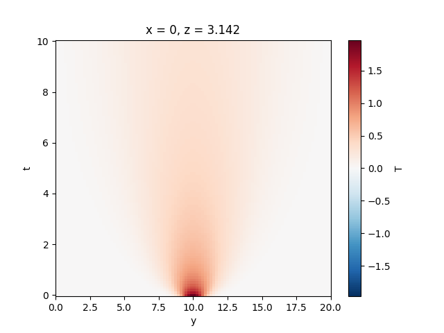

.. highlight:: console

.. _sec-quickstart:

==================
 Quickstart Guide
==================

This section will quickly walk you through getting and building the
BOUT++ source code, and running one of the examples.

Prerequisites
=============

To build BOUT++ and analyse the output of its models, you will need
the following tools and libraries:

* ``git`` (>= 2.x)
* `CMake <https://cmake.org/>`_
* a C++-14 compiler (for example, GCC >= 5.0)
* an ``MPI`` implementation (for example OpenMPI or MPICH)
* The `NetCDF C library
  <https://www.unidata.ucar.edu/downloads/netcdf>`__
* `xBOUT <https://github.com/boutproject/xBOUT>`_ (for analysis)

See :ref:`sec-install` and :ref:`sec-advancedinstall` for more
information on installing these and other optional dependencies.

Make sure you have all of these installed, and in particular that
``nc-config`` is in your ``$PATH``.

Building BOUT++
===============

We'll clone the BOUT++ repository and build it in separate
directories. We're going to automatically download and built the
netCDF C++ library as part of building BOUT++::

    # Downloads the repo into BOUT-dev:
    $ git clone https://github.com/boutproject/BOUT-dev.git
    # Configure the build directory:
    $ cmake -S BOUT-dev -B build_bout -DBOUT_DOWNLOAD_NETCDF_CXX4=ON
    # Build the library with four threads:
    $ cmake --build build_bout -j 4
    # Build the conduction example:
    $ cmake --build build_bout --target conduction

This might take a few minutes to build the whole library, especially
the first time you build it.

Assuming that all went ok, you'll now have built the
:ref:`sec-heat-conduction-model` physics model in
``build_bout/examples/conduction``.

Running BOUT++
==============

We can now run the conduction example::

    $ cd build_bout/examples/conduction
    $ mpiexec -np 2 ./conduction

You should see some output like::

    BOUT++ version 5.0.0
    Revision: b3ee80bfa2ad9b875b69ab072a392b3f548efea8
    Code compiled on Jul 27 2022 at 18:13:23

    B.Dudson (University of York), M.Umansky (LLNL) 2007
    Based on BOUT by Xueqiao Xu, 1999

    Processor number: 0 of 2

    pid: 28302

    Compile-time options:
            Runtime error checking enabled, level 2
            Parallel NetCDF support disabled
            Metrics mode is 2D

    ...

    9.900e+00          1       1.99e-02     0.8    0.0    0.1   66.4   32.8
    1.000e+01         10       2.10e-02     3.8    0.0    0.1   64.6   31.5
    Step 100 of 100. Elapsed 0:00:02.0 ETA 0:00:00.0
    Run finished at  : Thu Jul 28 10:17:31 2022
    Run time : 2 s
            Option datadir = data (default)
            Option settingsfile = BOUT.settings (default)
    Writing options to file data/BOUT.settings
            Option time_report:show = 0 (default)

(where we've cut out lots of text from the middle!)

Your exact output will differ a bit from the above, particularly the
revision hash and dates/times.

We can now have a look at the results using xBOUT:

.. code-block:: pycon

    >>> import xbout
    >>> df = xbout.open_boutdataset("data/BOUT.dmp.*.nc")
    >>> df["T"].plot()

which should produce something similar to the following figure:

   A 1D heat conduction example shows how an initial Gaussian
   temperature perturbation changes over time.
