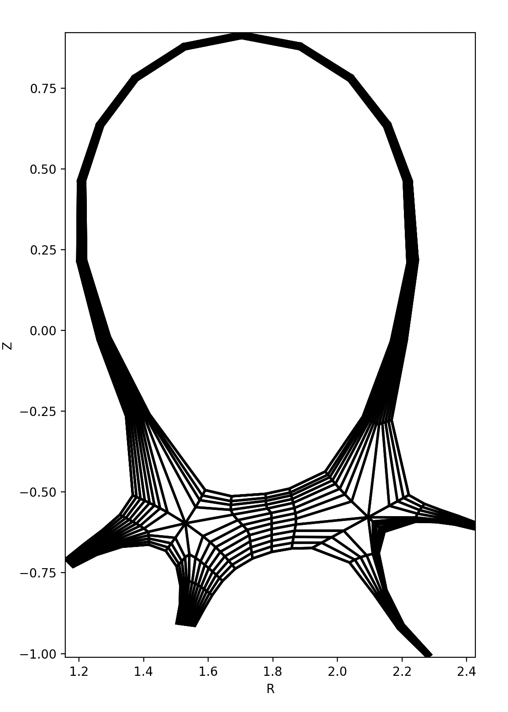

.. _sec-supported-topologies:

Supported Topologies
====================

BOUT++ can handle any tokamak topology with up to two X-points. Currently, the INGRID
and Hypnotoad gridding tools are the tools used to create BOUT++ grids.
Hypnotoad can create grids for any of the **basic and common topologies** while
INGRID can create grids for any of the **common and complex topologies**.

.. note::
   An EQDSK file is needed to create a grid in either of these tools.

Basic Topologies
----------------

Basic topologies are used for simpler simulations and don't need to use the
branch cut features. These include:

- **"Closed Flux Surface" (CFL)**: Which encompass the **"core"** and
  **"SOL"** configurations.
- **"Open Flux Surface" (OFL)**: Which encompass the **"limiter"**,
  **"X-point"**, and **"slab"** configurations.

These don't require a minimum number of processors to run.

Common Topologies
-----------------

Single Null (SN)
~~~~~~~~~~~~~~~~

The most common topology; most tokamaks operate or are able to use this
configuration.

.. figure:: ../figs/Topologies/SN/SN_Geometry.*
    :alt: The geometry of a single null configuration.

    Single null geometry on the RZ plane generated by INGRID.

The regions that form the building blocks of this topology are:

- 2 "leg" regions which have a boundary in the ``y`` direction;
- 1 "core" region which does not have boundaries in ``y``.

.. figure:: ../figs/Topologies/SN/SN_processors.*
    :alt: The processor layout of a single null configuration.

    Division of Single Null configuration into processor layout in index space to compare with the INGRID geometry diagram. 

.. figure:: ../figs/Topologies/SN/SN_regions.*
    :alt: The regions of a single null configuration.

    Single null configuration regions defined by the branch cuts in :math:`y`.
    

Even though BOUT++ does not requiere each region to be divided into more processors, using an INGRID grid enables this division and makes it easier to understand the topology.

.. figure:: ../figs/Topologies/SN/SN_topology.*
    :alt: The topology of a single null configuration.

    Single null configuration topology diagram derived from the processor layout.

Connected Double Null (CDN)
~~~~~~~~~~~~~~~~~~~~~~~~~~~

The introduction of a secondary divertor on the top of a tokamak is what
characterises this configuration. It has a secondary X-point associated with
the secondary divertor but the separatrix connects both X-points
(``ixseps1 == ixseps2``). It is an unstable configuration and quite hard to
maintain experimentally for a long period of time.

.. figure:: ../figs/Topologies/CDN/CDN_Geometry.*
    :alt: The geometry of a connected double null configuration.

    Connected double null geometry on the RZ plane generated by INGRID.

.. figure:: ../figs/Topologies/CDN/CDN_processors.*
    :alt: The processor layout of a connected double null configuration.

    Division of Connected Double Null configuration into processor layout in index space to compare with the INGRID geometry diagram. 

.. figure:: ../figs/Topologies/CDN/CDN_regions.*
    :alt: The regions of a connected double null configuration.

    Connected double null configuration regions defined by the branch cuts in :math:`y`.

.. figure:: ../figs/Topologies/CDN/CDN_topology.*
    :alt: The topology of a connected double null configuration.

    Connected double null configuration topology diagram derived from the processor layout.

Unconnected Double Null (UDN)
~~~~~~~~~~~~~~~~~~~~~~~~~~~~~

This more realistic configuration has a secondary X-point associated with the
secondary divertor but the X-points are not connected, creating a secondary
separatrix (``ixseps1 != ixseps2``). Depending on which separatrix coincides
with the start of the inner SOL, it is either an upper or lower **UDN**.
MAST-U is the most famous example of a reactor using the Double Null
configurations.

.. figure:: ../figs/Topologies/UDN/UDN_Geometry.*
    :alt: The geometry of an unconnected double null configuration.

    Unconnected double null geometry on the RZ plane generated by INGRID.

.. figure:: ../figs/Topologies/UDN/UDN_processors.*
    :alt: The processor layout of an unconnected double null configuration.

    Division of Unconnected Double Null configuration into processor layout in index space to compare with the INGRID geometry diagram. 

.. figure:: ../figs/Topologies/UDN/UDN_regions.*
    :alt: The regions of an unconnected double null configuration.

    Unconnected double null configuration regions defined by the branch cuts in :math:`y`.

.. figure:: ../figs/Topologies/UDN/UDN_topology.*
    :alt: The topology of an unconnected double null configuration.

    Unconnected double null configuration topology diagram derived from the processor layout.

Both **DN configurations** have 2 upper targets defined by ``ny_inner`` and
``ny_inner + 1``. The regions that form the building blocks of these topologies
are:

- 4 "leg" regions which have a boundary in the ``y`` direction;
- 2 "core" regions which do not have boundaries in ``y``.

Complex Topologies
------------------

Snowflake (SF)
~~~~~~~~~~~~~~

The snowflake features a secondary X-point close to the primary one. This
creates a second-order poloidal field null that branches the separatrix into
4 legs instead of 2. Much like the **CDN**, the ideal **SF** is very hard to
maintain experimentally, so SF configurations branch into either **SF+** or **SF-**. 

Snowflake+ (SF+)
~~~~~~~~~~~~~~~~

The **SF+** configuration has the secondary X-point in the PFR . Unlike the perfect **SF**,
this features an extra central PFR.

.. figure:: ../figs/Topologies/SF/SFplus_Geometry.*
    :alt: The geometry of a snowflake configuration.

    Snowflake geometry on the RZ plane generated by INGRID.

Snowflake- (SF-)
~~~~~~~~~~~~~~~~

The **SF-** configuration has the secondary X-point in the scrape-off layer as opposed to the private flux region. In the case of an "exact" **SF-**, both X-Points would be at different points on the same flux surface. 
Usually, **SF-** configurations have worst heat and particle distributions than the rest of the SF configurations.

    Snowflake geometry on the RZ plane generated by INGRID.

X-Point Target (XPT)
~~~~~~~~~~~~~~~~~~~~

The **X-Point Target** configuration has the main separatrix extended a longer
distance, the secondary X-point happens far away from the core plasma, and there is no PFR between the East and South East targets. 
This configuration is especially interesting for studying the effect of detachment and neutral gas injection on the plasma without contaminating the core.

.. todo::

   Add geometry diagram.

All **SF and X-Point Target configurations** have 4 targets defined by:

- West on ``y = 0``
- East on ``y = ny_inner``
- South East on ``y = ny_inner + 1``
- South West on ``y =`` :math:`2\pi`

Topologically, all the **SF configurations** and the **X-Point Target** are
the same. The regions that form the building blocks of these topologies are:

- 4 "leg" regions which have a boundary in the ``y`` direction;
- 1 "core" region which does not have boundaries in ``y``.

.. figure:: ../figs/Topologies/SF/SF_processors.*
    :alt: The processor layout of a snowflake configuration.

    Division of Snowflake configuration into processor layout in index space to compare with the INGRID geometry diagram. 

.. figure:: ../figs/Topologies/SF/SF_regions.*
    :alt: The regions of a snowflake configuration.

    Snowflake configuration regions defined by the branch cuts in :math:`y`.

.. figure:: ../figs/Topologies/SF/SF_topology.*
    :alt: The topology of a snowflake configuration.

    Snowflake configuration topology diagram derived from the processor layout.
