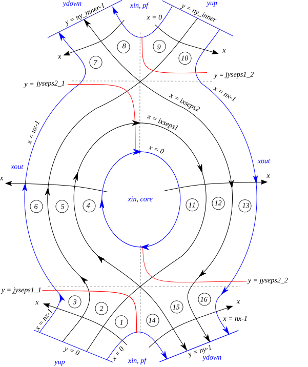

.. _sec-bout-topology:

BOUT++ Topology
===============

Basic
-----

BOUT++ is designed to work in a variety of tokamak and non-tokamak
geometries, from simple slabs to Snowflake configurations. In order to handle
tokamak geometry BOUT++ contains an internal topology which is built from
regions determined by four branch-cut locations (``jyseps*``) and two
separatrix locations (``ixseps1`` and ``ixseps2``). There are some limitations
on these regions that we will discuss below, and some regions may be empty,
all of which enables BOUT++ to describe effectively three types of basic
topologies:

- **"core"**: this type of topology can describe the closed field line regions
  inside the separatrix of tokamaks or other devices, or idealised geometries
  like periodic slabs;

- **"SOL"**: these can describe the open field line regions of the scrape-off
  layer (SOL) outside the separatrix of a tokamak, or linear devices with a
  target plate at either end;

- **"limiter"**: these topologies have an open field line region and a region
  where field lines hit a boundary, without an X-point;

- **"X-point"**: these topologies have four separate legs with their own
  boundaries, and no closed field line region;

The "common" topologies:

- **"single null"**: this type of topology has one X-point with two separate
  legs, closed and an open field line regions, and a single separatrix;

- **"connected double null"**: these topologies have two X-points with two
  separate legs each, closed and open field line regions and a single separatrix
  that connects both X-points;

- **"disconnected double null"**: these are similar to connected double null
  geometries except that they have two separatrices that do not connect the two
  X-points. These come in "lower" and "upper" flavours, depending on which
  X-point is adjacent to the closed field line region.

And all advanced/complex topologies with up to two X-points:

- **"snowflake"**: The SF topologies feature a second order null point created by two X-points close to each other. The ideal SF has a single separatrix and 4 legs, but more realistic configurations can have an extra PFR between the legs. 
  The **"snowflake+"** and **"snowflake-"** unlike the perfect **SF**, feature an extra central PFR and the secondary X-point is located either above or below the primary one, respectively (along the y-direction).
- **"X-Point Target"**: The X-Point Target configuration has the main separatrix extended a longer distance and no PFR between the East and South East targets.

See :ref:`sec-supported-topologies` for more details on the available
topologies.

The regions that form the building blocks of these topologies are:

- "leg" regions that have a boundary in the ``y`` direction;
- "core" regions that do not have boundaries in ``y``.

Each of these regions may have additional boundaries in the ``x`` direction.

Two important limitations for BOUT++ grids are that a single processor can only
belong to one region, and that there must be the same number of points on each
processor. The first limitation means that certain topologies require a minimum
number of processors. For example, a disconnected double null configuration uses
all six regions — therefore the minimum number of processors able to describe
this in BOUT++ is six. Having equal numbers of points on each processor can put
some restrictions on the resolution of simulations.

The two separatrix locations are ``ixseps1`` and ``ixseps2``, these are the
global indices in the ``x`` domain where the first and second separatrices are
located. These values are set either in the grid file or in ``BOUT.inp``.

Considering a Double Null example:

- If ``ixseps1 == ixseps2`` then there is a single separatrix representing
  the boundary between the core region and the SOL region and the grid is a
  **connected double null** configuration.
- If ``ixseps1 > ixseps2`` then there are two separatrices and the inner
  separatrix is ``ixseps2``, so the tokamak is an **upper double null**.
- If ``ixseps1 < ixseps2`` then there are two separatrices and the inner
  separatrix is ``ixseps1``, so the tokamak is a **lower double null**.

In other words: if ``ixseps1 > ixseps2``, then:

- ``f(x <= ixseps1, y, z)`` will be periodic in the ``y``-direction (core),
- ``f(ixseps1 < x <= ixseps2, y, z)`` will have boundary condition in ``y``
  set by the lowermost ``ydown`` and ``yup``,
- ``f(ixseps2 < x, y, z)`` will have boundary conditions set by the uppermost
  ``ydown`` and ``yup``.

The four branch cut locations, ``jyseps1_1``, ``jyseps1_2``, ``jyseps2_1``, and
``jyseps2_2``, split the ``y`` domain into logical regions defining the SOL, the
PFRs (private flux regions), and the core of the tokamak. If
``jyseps1_2 == jyseps2_1`` then the grid is a **single null** configuration,
otherwise it can be any of the more advanced configurations.

.. _fig-topology-cross-section:

   Deconstruction of a poloidal tokamak cross-section into logical
   domains using the parameters ``ixseps1``, ``ixseps2``,
   ``jyseps1_1``, ``jyseps1_2``, ``jyseps2_1``, and ``jyseps2_2``. This
   configuration is a "disconnected double null" and shows all the
   possible regions used in the BOUT++ topology.

Advanced
--------

The internal domain in BOUT++ is deconstructed into a series of logically
rectangular sub-domains with boundaries determined by the ``ixseps`` and
``jyseps`` parameters. The boundaries coincide with processor boundaries so the
number of grid points within each sub-domain must be an integer multiple of
``ny/nypes`` where ``ny`` is the number of grid points in ``y`` and ``nypes``
is the number of processors used to split the y domain. Processor communication
across the domain boundaries is then handled internally.

.. note::
   To ensure that each subdomain follows logically, the ``jyseps`` indices
   must adhere to the following conditions:

    - ``jyseps1_1 > -1``
    - ``jyseps2_1 >= jyseps1_1 + 1``
    - ``jyseps1_2 >= jyseps2_1``
    - ``jyseps2_2 >= jyseps1_2``
    - ``jyseps2_2 <= ny - 1``

   To ensure that communications work, branch cuts must align with processor
   boundaries.

.. _fig-topology-schematic:
.. figure:: ../figs/topology_schematic.*

   Schematic illustration of domain decomposition and communication in
   BOUT++ with ``ixseps1 = ixseps2``

These branch cuts are used by the ``getMeshTopology()`` function to determine
which topology is being used. See :ref:`sec-supported-topologies` for a
detailed explanation of the available topologies.

Number of targets
~~~~~~~~~~~~~~~~~

An extra cut in ``y`` called ``ny_inner`` defines where the physical boundary
in the domain is for topologies with more than 2 targets (any topology more
complex than the **single null** needs a "discontinuous" :math:`y` domain). The position of the extra
cut is what distinguishes any **double null** configuration from any of the
**complex** configurations.

Periodic X Domains
------------------

The :math:`x` coordinate is usually a radial flux coordinate. In some
simulations it is useful to make this direction periodic, for example flux tube
simulations or the Hasegawa-Wakatani example in
``examples/hasegawa-wakatani/hw.cxx``. In that example the :math:`x` coordinate
is made periodic with the top-level ``periodicX`` option:

.. code-block:: cfg

   periodicX = true # Domain is periodic in X

   [mesh]

   nx = 260  # Note 4 guard cells in X
   ny = 1
   nz = 256  # Periodic, so no guard cells in Z

Note that some care is needed if the model uses Laplacian inversions, for
example to calculate electrostatic potential from vorticity: if both :math:`x`
and :math:`z` coordinates are both periodic then the inversion has no boundary
conditions. In that case the Laplacian has a null space and so is singular; an
arbitrary constant offset can be added to the potential without changing the
vorticity.

The default ``cyclic`` solver treats the :math:`k_z = 0` (DC) mode as a
special case, setting the average of the potential over the :math:`x`-:math:`z`
domain to zero. Other solvers may not handle the ``periodicX`` case in the same
way.

Implementations
---------------

In BOUT++ each processor has a logically rectangular domain, so any branch cuts
needed for X-point geometry must be at processor boundaries.

In the standard "bout" mesh (``src/mesh/impls/bout/``), the communication is
controlled by the variables

.. code-block:: cpp

    int UDATA_INDEST, UDATA_OUTDEST, UDATA_XSPLIT;
    int DDATA_INDEST, DDATA_OUTDEST, DDATA_XSPLIT;
    int IDATA_DEST, ODATA_DEST;

These control the behavior of the communications as shown in
:numref:`fig-boutmesh-comms`.

.. _fig-boutmesh-comms:
.. figure:: ../figs/boutmesh-comms.*
   :alt: Communication of guard cells in BOUT++

   Communication of guard cells in BOUT++. Boundaries in X have only
   one neighbour each, but boundaries in Y can be split into two,
   allowing branch cuts.

In the Y direction, each boundary region (**U**\ p and **D**\ own in Y) can be
split into two, with ``0 <= x < UDATA_XSPLIT`` going to processor index
``UDATA_INDEST``, and ``UDATA_INDEST <= x < LocalNx`` going to
``UDATA_OUTDEST``. Similarly for the Down boundary. Since there are no
branch-cuts in the X direction, there is just one destination for the
**I**\ nner and **O**\ uter boundaries. In all cases a negative processor
number means that there is a domain boundary so no communication is needed.

The communication control variables are set in the ``BoutMesh::topology()``
function, in ``src/mesh/impls/bout/boutmesh.cxx``. First the function
``default_connections()`` sets the topology to be a rectangle.

To change the topology, the function ``BoutMesh::set_connection`` checks that
the requested branch cut is on a processor boundary, and changes the
communications consistently so that communications are two-way and there are no
"dangling" communications.
