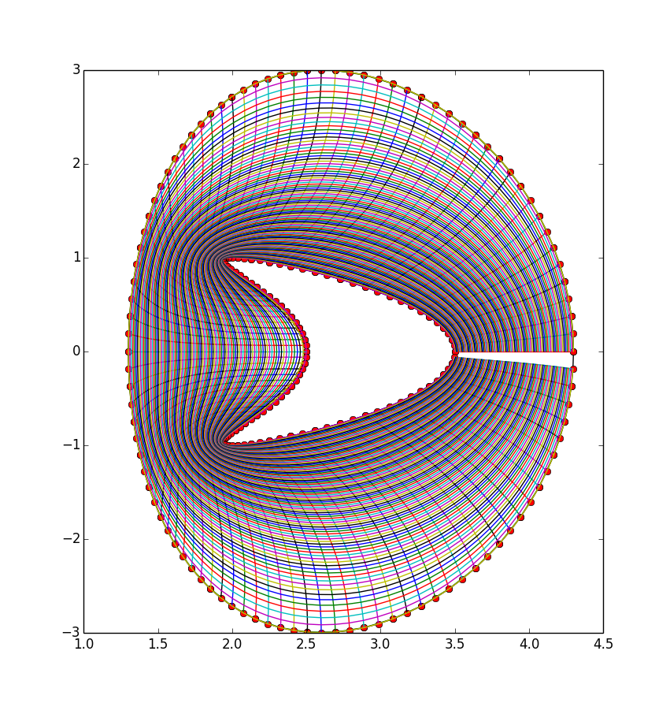
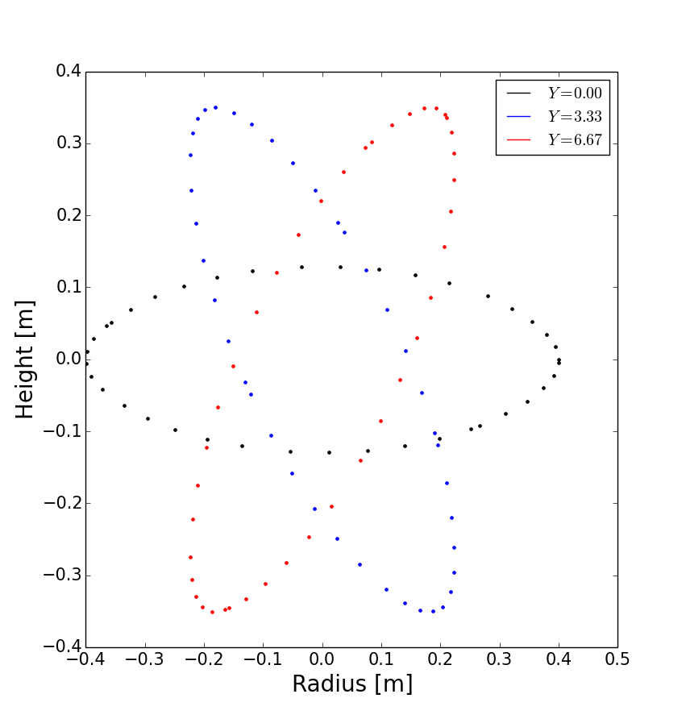

.. Use python as the default language for syntax highlighting in this file
.. highlight:: python

.. _sec-zoidberg:

Zoidberg grid generator
=======================

The Zoidberg grid generator creates inputs for the Flux Coordinate Independent (FCI)
parallel transform (section :ref:`sec-parallel-transforms`). The domain is
divided into a set of 2D grids in the X-Z coordinates, and the magnetic field is followed 
along the Y coordinate from each 2D grid to where it either intersects the forward
and backward grid, or hits a boundary.

The simplest code which creates an output file is::

   import zoidberg

   # Define the magnetic field
   field = zoidberg.field.Slab()
   # Define the grid points
   grid = zoidberg.grid.rectangular_grid(10,10,10)
   # Follow magnetic fields from each point
   maps = zoidberg.make_maps(grid, field)
   # Write everything to file
   zoidberg.write_maps(grid, field, maps, gridfile="grid.fci.nc")

As in the above code, creating an output file consists of the following steps:

1. Define a magnetic field
2. Define the grid points. This can be broken down into:
   
   a) Define 2D "poloidal" grids
   b) Form a 3D grid by putting 2D grids together along the Y direction

3. Create maps from each 2D grid to its neighbours
4. Save grids, fields and maps to file

Each of these stages can be customised to handle more complicated
magnetic fields, more complicated grids, and particular output formats. 
Details of the functionality available are described in sections below,
and there are several examples in the `examples/zoidberg` directory.

Rectangular grids
-----------------

An important input to Zoidberg is the size of the domain in Y, and
whether the domain is periodic in Y. By default ``rectangular_grid`` makes
a non-periodic rectangular box which is of length 10 in the Y direction.
This means that there are boundaries at :math:`y=0` and at :math:`y=10`.
``rectangular_grid`` puts the y slices at equally spaced intervals, and puts
the first and last points half an interval away from boundaries in y.
In this case with 10 points in y (second argument to ``rectangular_grid(nx,ny,nz)``)
the y locations are :math:`\left(0.5, 1.5, 2.5, \ldots, 9.5\right)`.

At each of these y locations ``rectangular_grid`` defines a rectangular 2D poloidal grid in
the X-Z coordinates, by default with a length of 1 in each direction and centred on :math:`x=0,z=0`. 
These 2D poloidal grids are then put together into a 3D ``Grid``. This process can be customised
by separating step 2 (the ``rectangular_grid`` call) into stages 2a) and 2b). 
For example, to create a periodic rectangular grid we could use the following::

   import numpy as np

   # Create a 10x10 grid in X-Z with sides of length 1
   poloidal_grid = zoidberg.poloidal_grid.RectangularPoloidalGrid(10, 10, 1.0, 1.0)
   # Define the length of the domain in y
   ylength = 10.0
   # Define the y locations
   ycoords = np.linspace(0.0, ylength, 10, endpoint=False)
   # Create the 3D grid by putting together 2D poloidal grids
   grid = zoidberg.grid.Grid(poloidal_grid, ycoords, ylength, yperiodic=True)

In the above code the length of the domain in the y direction needs to be given to ``Grid``
so that it knows where to put boundaries (if not periodic), or where to wrap the domain
(if periodic). The array of y locations ycoords can be arbitrary, but note that finite
difference methods (like FCI) work best if grid point spacing varies smoothly.

A more realistic example is creating a grid for a MAST tokamak equilibrium from a G-Eqdsk
input file (this is in ``examples/zoidberg/tokamak.py``)::

   import numpy as np
   import zoidberg
   
   field = zoidberg.field.GEQDSK("g014220.00200") # Read magnetic field

   grid = zoidberg.grid.rectangular_grid(100, 10, 100,
          1.5-0.1, # Range in R (max - min)
          2*np.pi, # Toroidal angle
          3., # Range in Z
          xcentre=(1.5+0.1)/2, # Middle of grid in R
          yperiodic=True) # Periodic in toroidal angle

   # Create the forward and backward maps
   maps = zoidberg.make_maps(grid, field)
   
   # Save to file
   zoidberg.write_maps(grid, field, maps, gridfile="grid.fci.nc")

   # Plot grid points and the points they map to in the forward direction
   zoidberg.plot.plot_forward_map(grid, maps)
   
In the last example only one poloidal grid was created (a ``RectangularPoloidalGrid``)
and then re-used for each y slice. We can instead define a different grid for each y
position. For example, to define a grid which expands along y (for some reason) we could do::

   ylength = 10.0
   ycoords = np.linspace(0.0, ylength, 10, endpoint=False)
   # Create a list of poloidal grids, one for each y location
   poloidal_grids = [ RectangularPoloidalGrid(10, 10, 1.0 + y/10., 1.0 + y/10.)
                      for y in ycoords ]
   # Create the 3D grid by putting together 2D poloidal grids
   grid = zoidberg.grid.Grid(poloidal_grids, ycoords, ylength, yperiodic=True)

Note: Currently there is an assumption that the number of X and Z points is the
same on every poloidal grid. The shape of the grid can however be completely
different. The construction of a 3D ``Grid`` is the same in all cases, so for now
we will concentrate on producing different poloidal grids.

More general grids
------------------

The FCI technique is not restricted to rectangular grids, and in particular
Zoidberg can handle structured grids in an annulus with quite complicated shapes.
The `StructuredPoloidalGrid` class handles quite general geometries,
but still assumes that the grid is structured and logically rectangular.
Currently it also assumes that the z index is periodic.

One way to create this grid is to define the grid points manually e.g.::

   import numpy as np
   import zoidberg

   # First argument is minor radius, second is angle
   r,theta = np.meshgrid(np.linspace(1,2,10),
                         np.linspace(0,2*np.pi, 10),
                         indexing="ij")
   
   R = r * np.sin(theta)
   Z = r * np.cos(theta)
  
   poloidal_grid = zoidberg.poloidal_grid.StructuredPoloidalGrid(R,Z)

For more complicated shapes than circles, Zoidberg comes with an
elliptic grid generator which needs to be given only the inner and
outer boundaries::

   import zoidberg

   inner = zoidberg.rzline.shaped_line(R0=3.0, a=0.5,
                            elong=1.0, triang=0.0, indent=1.0,
                            n=50)
   
   outer = zoidberg.rzline.shaped_line(R0=2.8, a=1.5,
                            elong=1.0, triang=0.0, indent=0.2,
                            n=50)
   
   poloidal_grid = zoidberg.poloidal_grid.grid_elliptic(inner, outer,
                                                 100, 100, show=True)

which should produce the figure below:

   
   A grid produced by ``grid_elliptic`` from shaped inner and outer lines

Grids aligned to flux surfaces
------------------------------

The elliptic grid generator can be used to generate grids
whose inner and/or outer boundaries align with magnetic flux surfaces.
All it needs is two ``RZline`` objects as generated by ``zoidberg.rzline.shaped_line``,
one for the inner boundary and one for the outer boundary.
``RZline`` objects represent periodic lines in R-Z  (X-Z coordinates), with
interpolation using splines.

To create an ``RZline`` object for a flux surface we first need to find
where the flux surface is. To do this we can use a Poincare plot: Start at a point
and follow the magnetic field a number of times around the periodic y direction
(e.g. toroidal angle). Every time the field line reaches a y location of interest,
mark the position to build up a scattered set of points which all lie on the same
flux surface.

At the moment this will not work correctly for slab geometries, but expects
closed flux surfaces such as in a stellarator or tokamak. A simple test case
is a straight stellarator::
   
   import zoidberg
   field = zoidberg.field.StraightStellarator(I_coil=0.4, yperiod=10)

By default ``StraightStellarator`` calculates the magnetic field due to four coils which spiral around
the axis at a distance :math:`r=0.8` in a classical stellarator configuration. The ``yperiod``
argument is the period in y after which the coils return to their starting locations.
   
To visualise the Poincare plot for this stellarator field, pass the ``MagneticField`` object
to ``zoidberg.plot.plot_poincare``, together with start location(s) and periodicity information::

   zoidberg.plot.plot_poincare(field, 0.4, 0.0, 10.0)

which should produce the following figure:

   
   Poincare map of straight stellarator showing a single flux
   surface. Each colour corresponds to a different x-z plane
   in the y direction. 
           
The inputs here are the starting location :math:`\left(x,z\right) = \left(0.4, 0.0\right)`,
and the periodicity in the y direction (10.0). By default this will
integrate from this given starting location 40 times (``revs`` option) around the y domain (0 to 10). 

To create an ``RZline`` from these Poincare plots we need a
list of points in order around the line. Since the points
on a flux surface in a Poincare will not generally be in order
we need to find the best fit i.e. the shortest path which passes through all the points without crossing itself. In general
this is a `known hard problem <https://en.wikipedia.org/wiki/Travelling_salesman_problem>`_
but fortunately in this case the nearest neighbour algorithm seems to be quite robust provided there are enough points.

An example of calculating a Poincare plot on a single y slice (y=0) and producing an ``RZline`` is::
   
   from zoidberg.fieldtracer import trace_poincare
   rzcoord, ycoords = trace_poincare(field, 0.4, 0.0, 10.0,
                                     y_slices=[0])
   
   R = rzcoord[:,0,0]
   Z = rzcoord[:,0,1]
          
   line = zoidberg.rzline.line_from_points(R, Z)

   line.plot()

**Note**: Currently there is no checking that the line created is a good solution. The line
could cross itself, but this has to be diagnosed manually at the moment. If the line is not a good
approximation to the flux surface, increase the number of points by setting the ``revs`` keyword
(y revolutions) in the ``trace_poincare`` call.

In general the points along this line are not evenly
distributed, but tend to cluster together in some regions and have large gaps in others. 
The elliptic grid generator places grid points on the boundaries
which are uniform in the index of the ``RZline`` it is given.
Passing a very uneven set of points will therefore result in
a poor quality mesh. To avoid this, define a new ``RZline``
by placing points at equal distances along the line::

   line = line.equallySpaced()

The example zoidberg/straight-stellarator-curvilinear.py puts the above methods together
to create a grid file for a straight stellarator.

Sections below now describe each part of Zoidberg in more detail. Further documentation
of the API can be found in the docstrings and unit tests.
   
Magnetic fields
---------------

The magnetic field is represented by a ``MagneticField`` class, in ``zoidberg.field``.
Magnetic fields can be defined in either cylindrical or Cartesian coordinates:

* In Cartesian coordinates all (x,y,z) directions have the same units of length
* In cylindrical coordinates the y coordinate is assumed to be an angle, so that
  the distance in y is given by :math:`ds = R dy` where :math:`R` is the major radius.  

Which coordinate is used is controlled by the ``Rfunc`` method, which should return the
major radius if using a cylindrical coordinate system.
Should return ``None`` for a Cartesian coordinate system (the default). 
  
Several implementations inherit from ``MagneticField``, and provide:
``Bxfunc``, ``Byfunc``, ``Bzfunc`` which give the components of the magnetic field in
the x,y and z directions respectively. These should be in the same units (e.g. Tesla) for
both Cartesian and cylindrical coordinates, but the way they are integrated changes depending
on the coordinate system.

Using these functions the ``MagneticField`` class provides a ``Bmag`` method and ``field_direction``
method, which are called by the field line tracer routines (in ``zoidberg.field_tracer``).

Slabs and curved slabs
~~~~~~~~~~~~~~~~~~~~~~

The simplest magnetic field is a straight slab geometry::

   import zoidberg
   field = zoidberg.field.Slab()

By default this has a magnetic field :math:`\mathbf{B} = \left(0, 1, 0.1 + x\right)`.

A variant is a curved slab, which is defined in cylindrical coordinates
and has a given major radius (default 1)::

   import zoidberg
   field = zoidberg.field.CurvedSlab()

Note that this uses a large aspect-ratio approximation, so the major radius
is constant across the domain (independent of x). 
    
Straight stellarator
~~~~~~~~~~~~~~~~~~~~

This is generated by four coils with alternating currents arranged
on the edge of a circle, which spiral around the axis::
   
   import zoidberg
   field = zoidberg.field.StraightStellarator()

.. note:: This requires Sympy to generate the magnetic field, so if
          unavailable an exception will be raised

G-Eqdsk files
-------------

This format is commonly used for axisymmetric tokamak equilibria, for example output from EFIT equilibrium
reconstruction. It consists of the poloidal flux psi, describing the magnetic field in R and Z, with the toroidal
magnetic field Bt given by a 1D function f(psi) = R*Bt which depends only on psi::

   import zoidberg
   field = zoidberg.field.GEQDSK("gfile.eqdsk")

VMEC files
~~~~~~~~~~

The VMEC format describes 3D magnetic fields in toroidal geometry, but only includes closed
flux surfaces::

   import zoidberg
   field = zoidberg.field.VMEC("w7x.wout")

Plotting the magnetic field
---------------------------

Routines to plot the magnetic field are in ``zoidberg.plot``. They include Poincare plots
and 3D field line plots. 

For example, to make a Poincare plot from a MAST equilibrium::

   import numpy as np
   import zoidberg
   field = zoidberg.field.GEQDSK("g014220.00200")
   zoidberg.plot.plot_poincare(field, 1.4, 0.0, 2*np.pi, interactive=True)

This creates a flux surface starting at :math:`R=1.4` and :math:`Z=0.0`. The fourth input (``2*np.pi``) is
the periodicity in the :math:`y` direction. Since this magnetic field is symmetric in y (toroidal angle),
this parameter only affects the toroidal planes where the points are plotted.

The ``interactive=True`` argument to ``plot_poincare`` generates a new set of points for every click
on the plot window.

Creating poloidal grids
-----------------------

The FCI technique is used for derivatives along the magnetic field
(in Y), and doesn't restrict the form of the grid in the X-Z
poloidal planes. A 3D grid created by Zoidberg is a collection of 2D planes
(poloidal grids), connected together by interpolations along
the magnetic field.To define a 3D grid we first need to define
the 2D poloidal grids.

Two types of poloidal grids can currently be created: Rectangular grids, and
curvilinear structured grids. All poloidal grids have the following
methods:

* ``getCoordinate()`` which returns the real space (R,Z) coordinates
  of a given (x,z) index, or derivatives thereof
* ``findIndex()`` which returns the (x,z) index of a given (R,Z) coordinate
  which in general is floating point
* ``metric()`` which returns the 2D metric tensor
* ``plot()`` which plots the grid

Rectangular grids
~~~~~~~~~~~~~~~~~

To create a rectangular grid, pass the number of points and lengths in the x and z directions
to ``RectangularPoloidalGrid``::

   import zoidberg
   
   rect = zoidberg.poloidal_grid.RectangularPoloidalGrid( nx, nz, Lx, Lz )

By default the middle of the rectangle is at :math:`\left(R,Z\right) = \left(0,0\right)`
but this can be changed with the ``Rcentre`` and ``Zcentre`` options.

Curvilinear structured grids
~~~~~~~~~~~~~~~~~~~~~~~~~~~~

To create the structured curvilinear grids inner and outer lines are needed
(two ``RZline`` objects). The ``shaped_line`` function creates ``RZline`` shapes
with the following formula:

.. math::
   
   R = R_0 - b + \left(a + b \cos\left(\theta\right)\cos\left(\theta + \delta\sin\left(\theta\right)\right)\right)

   Z = \left(1 + \epsilon\right)a\sin\left(\theta\right)

where :math:`R_0` is the major radius, :math:`a` is the minor radius,
:math:`\epsilon` is the elongation (``elong``), :math:`\delta` the triangularity (``triang``), and :math:`b` the indentation (``indent``).

